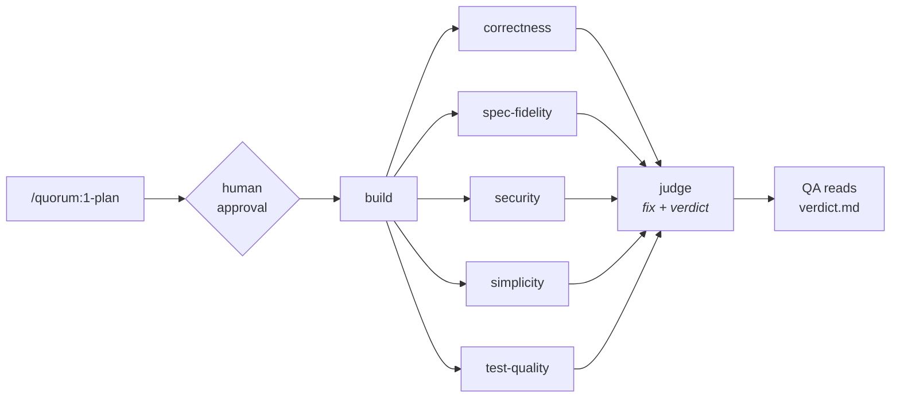

# Quorum

A Claude Code plugin marketplace holding reusable skills — a delivery pipeline
(**plan → build → review → adjudicate**) plus behavioral regression testing and
CI gating.

Run the steps by hand, or approve a plan and run
[`/quorum:pipeline`](#quorumpipeline--the-autonomous-run) to have the rest happen
unattended: build, five independent reviewers in parallel, then a judge that
applies fixes and stops only on a green suite or an honest red one.

This repo is the single canonical source for those skills. Future repos pull them
in by committing about eight lines of JSON; they do not copy the skills, and
nothing needs to be installed on anyone's machine beforehand.

---

## Why this exists

The failure mode this is built against is the one where an AI coding session
produces plausible code, reviews its own work, agrees with itself, and reports
success. Every design decision here is aimed at breaking that loop:

- **Intent is written down before code exists**, in falsifiable terms, so there is
  something to measure the result against later.
- **Review runs in fresh context, from the diff**, so the reviewer is not anchored
  by the reasoning that produced the code.
- **Review is a panel, not an opinion** — several independent lenses, each blind
  to the others' conclusions.
- **A judge adjudicates the panel** and is explicitly forbidden from the easy
  outs: weakening a test, narrowing the acceptance criteria, or declaring a
  criterion met when it isn't.
- **Tests must be proven able to fail.** A test that passes against broken code is
  worse than no test, because it is a merge gate you trust.

Once a plan is approved the whole thing runs unattended, so these stop being good
practice and start being the only safeguards there are. That is why the judge's
prohibitions are absolute rather than advisory, and why a run that ends *blocked*
with a clear reason counts as success.

### Why "quorum"

The fourth step is the point of the whole thing. A single reviewer produces an
opinion; a quorum produces a decision. Step 3 deliberately generates several
independent reviews so that step 4 has a real panel to adjudicate rather than one
voice to agree with.

---

## Installing into a repo

**You do not need to add this marketplace by hand, and neither does anyone else.**
Commit this to the target repo at `.claude/settings.json`:

```json
{
  "extraKnownMarketplaces": {
    "quorum": {
      "source": {
        "source": "github",
        "repo": "AiFirstDevelopment/quorum"
      }
    }
  },
  "enabledPlugins": {
    "quorum@quorum": true
  }
}
```

Commit it. From then on, anyone who opens that repo — you on any machine, a
teammate, a cloud session, a scheduled routine — gets the skills installed at
session start once they trust the project. Because settings live in version
control, the toolchain travels with the repo instead of with a laptop.

This is the part that matters: skills placed in `~/.claude/skills/` are personal
to one machine and do **not** reach cloud sessions, Cowork, or routines. Plugins
enabled only in user settings don't transfer either. A repo-declared marketplace
does.

**Pinning.** To freeze a repo against changes here, add a ref to the source:

```json
"source": { "source": "github", "repo": "AiFirstDevelopment/quorum", "ref": "v1.0.0" }
```

Omit `ref` to track the default branch and pick up improvements automatically.

**Manual install**, for trying it out without committing anything:

```
/plugin marketplace add AiFirstDevelopment/quorum
/plugin install quorum@quorum
```

---

## The pipeline



Everything from `build` rightward runs unattended inside `/quorum:pipeline`. The
same steps are also available individually as `/quorum:2-build`,
`/quorum:3-review`, and `/quorum:4-quorum` when you want to drive them by hand.

Skills are namespaced by their plugin, so they are invoked as `/quorum:1-plan`,
`/quorum:2-build`, and so on. The numeric prefixes keep them ordered in
autocomplete and make the sequence self-documenting.

`/quorum:pipeline` and steps 1–4 are **user-invoked only**
(`disable-model-invocation: true`). Claude will not spontaneously decide it is
time to run the judge, and it certainly will not launch an eight-agent unattended
run on its own — these are deliberate steps you trigger. The three testing and CI
skills are model-invocable, so Claude can reach for them when it recognizes the
need, including from inside the pipeline.

---

## The artifact contract

The pipeline steps hand state to each other through files. That handoff is a
contract, and it is defined once in
[`plugins/quorum/reference/contract.md`](plugins/quorum/reference/contract.md)
rather than re-improvised by each skill:

```
docs/work/<slug>/
├── plan.md              # 1-plan writes it; 2-build ticks its checkboxes
├── reviews/
│   ├── 001-correctness.md
│   ├── 002-spec-fidelity.md
│   └── ...              # 3-review writes one file per lens
└── verdict.md           # 4-quorum writes it
```

`<slug>` comes from an explicit argument, or from the branch name, and never from
the default branch — work happening on `main` is a signal something is wrong, not
a slug to derive. Reviews are numbered per work item and are **append-only**,
including reviews that later turned out to be wrong; the record is evidence.

Keying artifacts to a slug rather than a fixed `docs/plan.md` means two features
in flight don't collide, and you keep the history of what was planned and why.

---

## The skills

### `/quorum:pipeline` — the autonomous run

Takes an approved plan and delivers the change with no further human involvement.
One human gate, at the start; after that, the next thing a person sees is
`verdict.md`.

It runs a deterministic [workflow script](plugins/quorum/workflow/pipeline.js)
rather than improvising the orchestration, so the sequence is identical every run
and a failed run resumes instead of being re-paid for:

1. **Build** — one agent implements the plan.
2. **Review** — five lens agents run **in parallel, in fresh context**, each
   returning schema-validated findings. This is a genuine barrier: the judge needs
   all five at once.
3. **Record** — a write-only scribe transcribes the findings verbatim to
   `docs/work/<slug>/reviews/`.
4. **Adjudicate** — the judge verifies findings against the code, fixes the real
   ones, and runs the suite. At most **two passes**; then it stops.

Eight agents per run.

**Per branch, on demand — not per commit.** The unit of work is the whole branch:
the diff is measured from the fork point to `HEAD`, the slug comes from the branch
name, and the acceptance criteria describe a finished change. Run it when the
branch is ready for judgment, usually once before opening a PR. Running it per
commit reviews half-finished work against criteria nothing has met yet.

Running it **twice on the same branch is normal** — after more work lands, or
after a `blocked` run is unblocked. Reviews are append-only, so round two writes
`006-…` and leaves round one intact, and the approval gate fires again because
every unattended run gets its own authorization.

**Never wire it into CI or a git hook.** The judge writes code; a judge triggered
by every push would commit to the branch unsupervised, on top of its own previous
output, with no approval gate anywhere. CI runs the regression suite
([`/quorum:add-ci`](#quorumadd-ci)); judgment stays on demand.

**The approval gate.** If the plan's *Status* isn't `approved`, the skill shows
you Intent, Acceptance criteria, Non-goals, and any unanswered Open questions, and
asks. Unanswered questions matter more here than anywhere else: after this point
there is nobody to ask, and the builder must guess and record the guess. `1-plan`
is forbidden from writing `approved` itself — a plan that approves its own
execution defeats the only checkpoint in the system.

**Give-up conditions.** An unattended pipeline must be able to fail cleanly rather
than grind or paper over:

- Suite still red after two judging passes → stops, `outcome: blocked`, reports
  exactly what fails.
- All review lenses fail → throws rather than adjudicating blind.
- A single lens fails → run continues, but the missing lens is reported as an
  **unexamined dimension**, not a clean bill of health.
- Any escalation or unmet criterion forces `ready with follow-ups` or `blocked` —
  never `ready`.

**A run that ends `blocked` with a clear reason is this pipeline working.** The
failure mode it exists to prevent is a green suite bought by deleting a test.

### `/quorum:1-plan`

Investigates the request and writes `docs/work/<slug>/plan.md`. **Writes no code.**

The document captures **Intent**, **Acceptance criteria**, **Non-goals**, **Open
questions**, **Approach**, **Steps**, and a **Test strategy**. Acceptance criteria
are the load-bearing part — they must be observable and falsifiable, checkable by
someone who did not write the code, by operating the assembled application. "The
service layer is refactored cleanly" is not a criterion; "when a user submits the
form with an empty email, the form stays open and shows 'Email is required'" is.

Ambiguity that would change the shape of the work becomes an **Open question** put
to you, not a silent assumption.

### `/quorum:2-build`

Implements the plan, ticking each step's checkbox as it completes — which makes an
interrupted session resumable, since the plan itself shows where work stopped.

Deviations from the plan get appended to **Build notes** as they happen, because
an unrecorded deviation reads as a defect at review time. The skill may not edit
Intent, Acceptance criteria, or Non-goals — that is step 1's output and step 4's
yardstick. Scope changes are escalated, never absorbed; if the plan turns out to
be wrong, it stops and says so rather than quietly redesigning.

### `/quorum:3-review`

Produces **several independent reviews from different lenses**, each in fresh
context (a separate subagent per lens where available), each written to its own
file. **Changes no code** — not even an obvious typo — because a reviewer who
edits contaminates the evidence step 4 weighs.

Five default lenses:

| Lens | Remit |
|---|---|
| `correctness` | Logic errors, unhandled cases, races, error handling |
| `spec-fidelity` | Every acceptance criterion actually met? Anything from Non-goals built anyway? |
| `security` | Injection, authz gaps, secret handling, data exposure, dependency risk |
| `simplicity` | Duplication, needless abstraction, dead code, missed reuse |
| `test-quality` | Do the tests fail if behavior breaks? Assertion-free tests, flakiness risk |

Every finding requires a `file:line` and a **concrete failure scenario** — inputs
or state, and the wrong result that follows. A finding that can't be stated that
way is speculation and gets dropped. Ten weak findings are worse than two real
ones, because step 4 then spends its judgment filtering instead of fixing.

### `/quorum:4-quorum`

The judge. Reads the plan, the diff, and every review, then assigns each finding
exactly one disposition — **Accepted** (real, fixed), **Rejected** (with a reason),
or **Escalated** (real, but the decision isn't its to make). It verifies findings
against the code itself, because reviewers are sometimes confidently wrong.

It independently walks every acceptance criterion, since a criterion no lens
happened to examine can still be unmet.

Four things it may **not** do, each closing an easy way to make a problem
disappear instead of solving it:

- weaken, skip, or delete a test to resolve a finding
- edit Intent, Acceptance criteria, or Non-goals — it doesn't get to move the target
- mark a criterion met when it isn't
- expand scope; real defects outside this change become recorded follow-ups

It ends by running the regression suite and **is not done until that suite is
green**, then writes `verdict.md` — an audit trail you read instead of re-deriving
its reasoning from the diff.

### `/quorum:add-regression-tests`

Writes behavioral tests against the **fully assembled application**, driven through
its outermost user-facing surface. The objective is deliberately **not** a coverage
number:

> Every behavior introduced or changed by this diff has a test that fails if that
> behavior regresses.

Coverage is used as a *diagnostic to find gaps*, never as the target — chasing a
percentage reliably produces assertion-free tests that execute lines without
checking anything.

It carries the Angular/DOM Testing Library philosophy across stacks as
principles rather than APIs: query the way a user perceives (accessible role,
visible label, text — never CSS classes or internal ids), assert observable
outcomes rather than internal state, never reach into internals, mock only at the
true system boundary, and name each test after the behavior in plain language.
The skill maps "the UI surface" onto web apps, HTTP APIs, CLIs, libraries, mobile
apps, and queue workers. Unit tests are reserved for pure logic that genuinely
needs hardening — parsers, date math, pricing rules, state machines.

**Fail-first verification** is the rule that makes it worth running. For every new
test: deliberately break the behavior, confirm the test fails *for the expected
reason*, then restore and confirm it passes. Any test that doesn't fail when the
behavior is broken isn't testing what you think, and gets rewritten or deleted.

Determinism is mandated throughout — frozen clocks, stubbed network, seeded
randomness, condition-waits instead of sleeps, no shared state between tests —
because flakiness is what kills a suite used as a merge gate. A suite people
re-run until it goes green isn't a gate.

### `/quorum:run-regression-tests`

Runs the full suite. Uses a recorded recipe if the repo has one (including the
`.claude/skills/` recipes that Claude Code's own `/run-skill-generator` and
`/verify` produce), otherwise discovers it — preferring the CI workflow, since
that's what actually gates merges — and then **records it** so the next run is
deterministic.

The valuable part is classifying every failure, because step 4 makes a different
decision for each: **code broken**, **test broken** (needs a human — silently
"fixing" the test erases the regression it was guarding), **environment**, or
**flake** (detected by re-running once, and reported as a real defect in the
suite). It modifies nothing, never reports success on a partial run without
saying so, and always surfaces skipped tests — a suite that quietly skips is
indistinguishable from one that passes.

### `/quorum:add-ci`

Wires the suite into CI as a **required status check**, because a suite that
doesn't block merges is documentation, not a gate. Extends an existing CI config
rather than adding a competing one, keeps the job name stable (branch protection
references it by name, so a rename silently disables the gate), and never makes a
job non-blocking to get it green.

It also explains the part no file can do: branch protection is a repository
setting, so the workflow alone blocks nothing. The skill supplies the exact
`gh api` command and asks before running it.

---

## Enforcement, not just instruction

With no human in the loop, a rule written in prose is a rule a model can drift
past. The pipeline ships [agent definitions](plugins/quorum/agents/) whose tool
lists make the two most load-bearing constraints structural:

| Agent | Tools | Effect |
|---|---|---|
| `quorum-reviewer` | `Read, Grep, Glob, Bash` | No `Edit`, no `Write`. "Review fixes nothing" stops being a request. |
| `quorum-scribe` | `Write` | Cannot read source, so it can only transcribe findings — not editorialize about code. |
| `quorum-builder` | default | Build rules baked into its system prompt. |
| `quorum-judge` | default | Needs full tools; it is the one agent that legitimately edits code. |

**Being honest about how far this goes:** removing `Edit` and `Write` closes the
easy path and the accidental path, not every path — a reviewer still has `Bash`,
which it needs to read the diff, and `Bash` can write files. This raises the cost
of drift substantially; it is not a sandbox. The reviewers also never *return* a
patch, so there is no edit for the judge to apply blindly.

Separating the scribe from the judge is deliberate too: the judge adjudicates
reviews it did not write, from files it did not author, so the record it is
weighed against isn't its own.

---

## A prompt for a new repo

Paste this into Claude Code in a repo that should adopt this workflow. It explains
the system and wires it up.

```text
This repo should adopt the "quorum" Claude Code workflow. Here is what it is and
what I want you to do.

WHAT QUORUM IS

Quorum is a plugin marketplace at https://github.com/AiFirstDevelopment/quorum
providing eight skills: a delivery pipeline plus testing and CI.

  /quorum:pipeline After I approve a plan, run everything unattended: build, five
                   independent review lenses in parallel, then a judge that applies
                   fixes and ends on a green suite or an honest red one. Plan
                   approval is the only human gate; the next thing I see is
                   docs/work/<slug>/verdict.md.

  /quorum:1-plan   Investigate a change request and write docs/work/<slug>/plan.md
                   capturing Intent, falsifiable Acceptance criteria, Non-goals,
                   and Open questions. Writes no code.
  /quorum:2-build  Implement that plan, ticking off steps and recording deviations.
                   Never edits Intent, Acceptance criteria, or Non-goals.
  /quorum:3-review Review the diff in fresh context from five independent lenses
                   (correctness, spec-fidelity, security, simplicity, test-quality),
                   one file per lens under docs/work/<slug>/reviews/. Fixes nothing.
  /quorum:4-quorum Act as judge over the plan, the diff, and all reviews. Accept,
                   reject, or escalate each finding; apply accepted fixes; end with
                   a green test suite; write docs/work/<slug>/verdict.md.

  /quorum:add-regression-tests  Behavioral tests against the fully assembled app,
                   driven through its outermost user-facing surface, each one
                   proven to fail when the behavior it guards is broken.
  /quorum:run-regression-tests  Run the full suite and classify every failure as
                   code-broken, test-broken, environment, or flake.
  /quorum:add-ci   Make the suite a required status check so PRs cannot merge red.

ITS PURPOSE

It exists to stop the loop where an AI session writes plausible code, reviews its
own work, agrees with itself, and reports success. So: intent is written down
before code exists; review happens in fresh context from the diff rather than from
the build's own reasoning; review is a panel of independent lenses rather than one
opinion; and a judge adjudicates that panel while being forbidden from weakening a
test, moving the acceptance criteria, or claiming a criterion is met when it is
not. Tests must be proven capable of failing, because a test that passes against
broken code is a merge gate you wrongly trust.

WHAT I WANT YOU TO DO NOW

1. Create .claude/settings.json in this repo (merge into it if it already exists):

   {
     "extraKnownMarketplaces": {
       "quorum": {
         "source": { "source": "github", "repo": "AiFirstDevelopment/quorum" }
       }
     },
     "enabledPlugins": { "quorum@quorum": true }
   }

2. Create the docs/work/ directory with a .gitkeep so the artifact contract has a
   home.

3. Tell me to restart Claude Code (or run /reload-plugins) so the skills load, and
   confirm they appear by listing them.

4. Then stop. Do not start any work. I will begin with /quorum:1-plan, approve the
   plan, and then run /quorum:pipeline.
```

---

## Repo layout

```
quorum/
├── .claude-plugin/
│   └── marketplace.json          # the catalog: name, owner, plugins[]
├── plugins/
│   └── quorum/
│       ├── .claude-plugin/
│       │   └── plugin.json       # plugin manifest
│       ├── agents/               # tool-restricted agents used by the pipeline
│       │   ├── quorum-builder.md
│       │   ├── quorum-reviewer.md
│       │   ├── quorum-scribe.md
│       │   └── quorum-judge.md
│       ├── workflow/
│       │   └── pipeline.js       # deterministic orchestration for /quorum:pipeline
│       ├── reference/
│       │   └── contract.md       # shared artifact contract, read by the skills
│       └── skills/
│           ├── pipeline/SKILL.md
│           ├── 1-plan/SKILL.md
│           ├── 2-build/SKILL.md
│           ├── 3-review/SKILL.md
│           ├── 4-quorum/SKILL.md
│           ├── add-regression-tests/SKILL.md
│           ├── run-regression-tests/SKILL.md
│           └── add-ci/SKILL.md
└── README.md
```

## Working on the skills

Validate manifests before pushing — repos tracking the default branch pick up
changes immediately:

```bash
claude plugin validate .
claude plugin validate ./plugins/quorum
```

To test a change without pushing, add the local checkout as a marketplace:

```
/plugin marketplace add ./path/to/quorum
```

Changes to `workflow/pipeline.js` are worth testing against a throwaway repo
before pushing — a bad orchestration script fails eight agents deep, and repos
tracking the default branch pick it up immediately. Pin those repos to a tag if
that matters.

Adding a skill means creating `plugins/quorum/skills/<name>/SKILL.md` with a
`description` in its frontmatter — that description is how Claude decides when the
skill is relevant, so it should say *when to use it*, not just what it does. Add
`disable-model-invocation: true` for anything that should only ever run when you
type it. No manifest edit is needed; skills are discovered from the directory.
