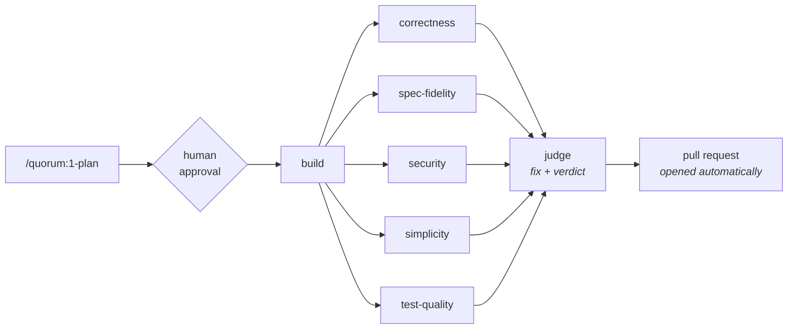

# starter

A Claude Code plugin marketplace — the starter kit you pull into a new repo to
get a working delivery discipline on day one.

Two plugins, adoptable together or separately:

| Plugin | What it gives you |
|---|---|
| **[`quorum`](plugins/quorum/)** | Plan → build → multi-lens review → adjudication → pull request. Run it step by step, or approve a plan and let it run unattended. |
| **[`tests`](plugins/tests/)** | Behavioral regression tests against the assembled application, each proven able to fail, gated in CI. |

Future repos pull these in by committing a few lines of JSON. They do not copy the
skills, and nothing needs to be installed on anyone's machine beforehand.

---

## Why this exists

The failure mode this is built against is the one where an AI session produces
plausible code, reviews its own work, agrees with itself, and reports success.
Every design decision here is aimed at breaking that loop:

- **Intent is written down before code exists**, in falsifiable terms, so there is
  something to measure the result against later.
- **Review runs in fresh context, from the diff**, so the reviewer is not anchored
  by the reasoning that produced the code.
- **Review is a panel, not an opinion** — five independent lenses, each blind to
  the others' conclusions.
- **A judge adjudicates the panel** and is explicitly forbidden from the easy
  outs: weakening a test, narrowing the acceptance criteria, or declaring a
  criterion met when it isn't.
- **Tests must be proven able to fail.** A test that passes against broken code is
  worse than no test, because it is a merge gate you trust.

Once a plan is approved the whole thing runs unattended, so these stop being good
practice and start being the only safeguards there are. That is why the judge's
prohibitions are absolute rather than advisory, and why a run that ends *blocked*
with a clear reason counts as success.

### Why the pipeline is called "quorum"

The fourth step is the point of it. A single reviewer produces an opinion; a
quorum produces a decision. Step 3 deliberately generates several independent
reviews so that step 4 has a real panel to adjudicate rather than one voice to
agree with.

---

## Installing into a repo

**Nobody needs to add this marketplace by hand.** Commit this to the target repo
at `.claude/settings.json`:

```json
{
  "extraKnownMarketplaces": {
    "starter": {
      "source": {
        "source": "github",
        "repo": "AiFirstDevelopment/starter"
      }
    }
  },
  "enabledPlugins": {
    "quorum@starter": true,
    "tests@starter": true
  }
}
```

From then on, anyone who opens that repo — you on any machine, a teammate, a cloud
session, a scheduled routine — gets the skills at session start once they trust
the project. Because settings live in version control, the toolchain travels with
the repo instead of with a laptop.

That is the part that matters: skills placed in `~/.claude/skills/` are personal
to one machine and do **not** reach cloud sessions, Cowork, or routines. Plugins
enabled only in user settings don't transfer either. A repo-declared marketplace
does.

**Adopt one, not both.** `tests@starter` stands alone — a repo can take the
testing discipline without an autonomous judge, which is the right call for most
existing codebases. `quorum@starter` works without `tests`, but expects it: the
judge must run a regression suite to reach a verdict, and falls back to finding
and running it itself when `/tests:run` is unavailable.

**Pinning.** To freeze a repo against changes here, add a ref:

```json
"source": { "source": "github", "repo": "AiFirstDevelopment/starter", "ref": "v1.0.0" }
```

Omit `ref` to track the default branch and pick up improvements automatically.

**Trying it out** without committing anything:

```
/plugin marketplace add AiFirstDevelopment/starter
/plugin install quorum@starter
/plugin install tests@starter
```

---

# The `quorum` plugin



Everything from `build` rightward runs unattended inside `/quorum:pipeline`. The
same steps are also available individually — `/quorum:2-build`,
`/quorum:3-review`, `/quorum:4-quorum` — when you want to drive them by hand.

`/quorum:pipeline` and steps 1–4 are **user-invoked only**
(`disable-model-invocation: true`). Claude will not spontaneously decide it is
time to run the judge, and it certainly will not launch a nine-agent unattended
run on its own. The `tests` skills are model-invocable, so Claude can reach for
them when it recognizes the need, including from inside the pipeline.

## The artifact contract

The steps hand state to each other through files. That handoff is a contract, and
it is defined once in
[`plugins/quorum/reference/contract.md`](plugins/quorum/reference/contract.md)
rather than re-improvised by each skill:

```
docs/work/<slug>/
├── plan.md              # 1-plan writes it; 2-build ticks its checkboxes
├── reviews/
│   ├── 001-correctness.md
│   ├── 002-spec-fidelity.md
│   └── ...              # one file per lens, append-only
└── verdict.md           # the judge's full record
```

`<slug>` comes from an explicit argument, or from the branch name, and never from
the default branch — work happening on `main` is a signal something is wrong, not
a slug to derive. Keying artifacts to a slug rather than a fixed `docs/plan.md`
means two features in flight don't collide, and you keep the history of what was
planned and why.

**These artifacts are the record, not the interface.** The pull request is what
you read at QA time; `verdict.md` is what you open when the PR raises a question
and you want the reasoning behind it.

## `/quorum:pipeline` — the autonomous run

Takes an approved plan and delivers the change with no further human involvement.
One gate, at the start; the next thing you see is a pull request.

It runs a deterministic [workflow script](plugins/quorum/workflow/pipeline.js)
rather than improvising the orchestration, so the sequence is identical every run
and a failed run resumes instead of being re-paid for:

1. **Build** — one agent implements the plan and commits.
2. **Review** — five lens agents run **in parallel, in fresh context**, each
   returning schema-validated findings. A genuine barrier: the judge needs all
   five at once.
3. **Record** — a write-only scribe transcribes the findings verbatim to
   `docs/work/<slug>/reviews/`.
4. **Adjudicate** — the judge verifies findings against the code, fixes the real
   ones, commits separately so the diff shows what adjudication changed, and runs
   the suite. At most **two passes**, then it stops.
5. **Publish** — pushes the branch and opens the pull request, or updates the
   existing one.

Nine agents per run.

### The pull request is the deliverable

The publisher reads the verdict and writes a PR body for someone who was not
there: what the change does, **what needs a decision**, an acceptance-criteria
table with met/unmet, the review tally by lens, test status, and follow-ups. It
detects the host from the remote — `gh` for GitHub, `glab` for GitLab — and if
neither is available it prints the title, body, and command rather than failing
the run.

- Verdict `ready` or `ready with follow-ups` → PR opened ready for review
- Verdict `blocked` → **draft** PR, titled `[blocked]`, body leading with what is
  failing

A blocked run still opens a PR, because the work exists and someone needs to see
it — it just isn't inviting a merge. The publisher never merges, never approves,
never enables auto-merge, and never force-pushes. Re-running the pipeline on a
branch **updates the existing PR** rather than opening a second.

### Per branch, on demand — not per commit

The unit of work is the whole branch: the diff is measured from the fork point to
`HEAD`, the slug comes from the branch name, and the acceptance criteria describe
a finished change. Run it when the branch is ready for judgment. Running it per
commit reviews half-finished work against criteria nothing has met yet.

Running it **twice on the same branch is normal** — after more work lands, or
after a `blocked` run is unblocked. Reviews are append-only, so round two writes
`006-…` and leaves round one intact, and the approval gate fires again because
every unattended run gets its own authorization.

**Never wire it into CI or a git hook.** The judge writes code and the publisher
pushes; triggered by every push, it would commit to the branch unsupervised on top
of its own previous output with the approval gate bypassed entirely. CI runs the
regression suite (`/tests:ci`); judgment stays on demand.

### The approval gate

If the plan's *Status* isn't `approved`, the skill shows you Intent, Acceptance
criteria, Non-goals, and any unanswered Open questions, and asks — making clear
you are authorizing an unattended run that will write code, apply fixes, push, and
open a PR.

Unanswered questions matter more here than anywhere else: after this point there
is nobody to ask, and the builder must guess and record the guess. `1-plan` is
forbidden from writing `approved` itself — a plan that approves its own execution
defeats the only checkpoint in the system.

### Give-up conditions

An unattended pipeline must fail cleanly rather than grind or paper over:

- Suite still red after two judging passes → stops, `outcome: blocked`, draft PR
  reporting exactly what fails
- All review lenses fail → throws rather than adjudicating blind
- A single lens fails → run continues, but the missing lens is reported as an
  **unexamined dimension**, not a clean bill of health
- Any escalation or unmet criterion forces `ready with follow-ups` or `blocked` —
  never `ready`
- Publishing impossible → run still succeeds; the PR body is printed for a human

**A run that ends `blocked` with a clear reason is this pipeline working.** The
failure mode it exists to prevent is a green suite bought by deleting a test.

## The steps

### `/quorum:1-plan`

Investigates the request and writes `docs/work/<slug>/plan.md`. **Writes no code.**

Captures **Intent**, **Acceptance criteria**, **Non-goals**, **Open questions**,
**Approach**, **Steps**, and a **Test strategy**. Acceptance criteria are the
load-bearing part — observable, falsifiable, checkable by someone who did not
write the code, by operating the assembled application. "The service layer is
refactored cleanly" is not a criterion; "when a user submits the form with an
empty email, the form stays open and shows 'Email is required'" is.

Ambiguity that would change the shape of the work becomes an **Open question** put
to you, not a silent assumption.

### `/quorum:2-build`

Implements the plan, ticking each step's checkbox as it completes — which makes an
interrupted session resumable. Deviations get appended to **Build notes** as they
happen, because an unrecorded deviation reads as a defect at review time.

May not edit Intent, Acceptance criteria, or Non-goals. Scope changes are
escalated, never absorbed. Running unattended it cannot stop to ask, so a plan
that turns out to be wrong gets a loud `PLAN DEFECT` note that the reviewers read
and the judge escalates.

### `/quorum:3-review`

Produces **several independent reviews from different lenses**, each in fresh
context, each written to its own file. **Changes no code** — not even an obvious
typo — because a reviewer who edits contaminates the evidence step 4 weighs.

| Lens | Remit |
|---|---|
| `correctness` | Logic errors, unhandled cases, races, error handling |
| `spec-fidelity` | Every acceptance criterion actually met? Anything from Non-goals built anyway? |
| `security` | Injection, authz gaps, secret handling, data exposure, dependency risk |
| `simplicity` | Duplication, needless abstraction, dead code, missed reuse |
| `test-quality` | Do the tests fail if behavior breaks? Assertion-free tests, flakiness risk |

Every finding needs a `file:line` and a **concrete failure scenario** — inputs or
state, and the wrong result that follows. A finding that can't be stated that way
is speculation and gets dropped. Ten weak findings are worse than two real ones,
because the judge then spends its judgment filtering instead of fixing.

### `/quorum:4-quorum`

The judge. Reads the plan, the diff, and every review, then assigns each finding
exactly one disposition — **Accepted** (real, fixed), **Rejected** (with a reason),
or **Escalated** (real, but not its decision to make). It verifies findings against
the code itself, because reviewers are sometimes confidently wrong, and
independently walks every acceptance criterion, since one no lens examined can
still be unmet.

Four things it may **not** do, each closing an easy way to make a problem
disappear instead of solving it:

- weaken, skip, or delete a test to resolve a finding
- edit Intent, Acceptance criteria, or Non-goals — it doesn't move the target
- mark a criterion met when it isn't
- expand scope; real defects outside this change become recorded follow-ups

It ends by running the suite and **is not done until that suite is green**, then
writes `verdict.md`.

---

# The `tests` plugin

Stands alone. A repo can adopt this without the pipeline; when both are enabled,
`/tests:add` uses the plan's acceptance criteria as its checklist.

### `/tests:add`

Writes behavioral tests against the **fully assembled application**, driven through
its outermost user-facing surface. The objective is deliberately **not** a coverage
number:

> Every behavior introduced or changed by this diff has a test that fails if that
> behavior regresses.

Coverage is a *diagnostic for finding gaps*, never the target — chasing a
percentage reliably produces assertion-free tests that execute lines without
checking anything.

It carries the Angular/DOM Testing Library philosophy across stacks as principles
rather than APIs: query the way a user perceives (accessible role, visible label,
text — never CSS classes or internal ids), assert observable outcomes rather than
internal state, never reach into internals, mock only at the true system boundary,
and name each test after the behavior in plain language. The skill maps "the UI
surface" onto web apps, HTTP APIs, CLIs, libraries, mobile apps, and queue
workers. Unit tests are reserved for pure logic that genuinely needs hardening —
parsers, date math, pricing rules, state machines.

**Fail-first verification** is the rule that makes it worth running. For every new
test: deliberately break the behavior, confirm the test fails *for the expected
reason*, then restore and confirm it passes. Any test that doesn't fail when the
behavior is broken isn't testing what you think, and gets rewritten or deleted.

Determinism is mandated throughout — frozen clocks, stubbed network, seeded
randomness, condition-waits instead of sleeps, no shared state between tests —
because flakiness is what kills a suite used as a merge gate. A suite people
re-run until it goes green isn't a gate.

### `/tests:run`

Runs the full suite. Uses a recorded recipe if the repo has one (including those
Claude Code's own `/run-skill-generator` and `/verify` produce), otherwise
discovers it — preferring the CI workflow, since that's what actually gates
merges — and then **records it** so the next run is deterministic.

The valuable part is classifying every failure, because the judge makes a
different decision for each: **code broken**, **test broken** (needs a human —
silently "fixing" the test erases the regression it was guarding),
**environment**, or **flake** (detected by re-running once, and reported as a real
defect in the suite). It modifies nothing, never reports success on a partial run
without saying so, and always surfaces skipped tests — a suite that quietly skips
is indistinguishable from one that passes.

### `/tests:ci`

Wires the suite into CI as a **required status check**, because a suite that
doesn't block merges is documentation, not a gate. Extends an existing CI config
rather than adding a competing one, keeps the job name stable (branch protection
references it by name, so a rename silently disables the gate), and never makes a
job non-blocking to get it green.

It also explains the part no file can do: branch protection is a repository
setting, so the workflow alone blocks nothing. The skill supplies the exact
`gh api` command and asks before running it. And it states what CI must *never*
run: the pipeline, the builder, or the judge — those write code.

---

## Enforcement, not just instruction

With no human in the loop, a rule written in prose is a rule a model can drift
past. The pipeline ships [agent definitions](plugins/quorum/agents/) whose tool
lists make the load-bearing constraints structural:

| Agent | Tools | Effect |
|---|---|---|
| `quorum-reviewer` | `Read, Grep, Glob, Bash` | No `Edit`, no `Write`. "Review fixes nothing" stops being a request. |
| `quorum-scribe` | `Write` | Cannot read source, so it can only transcribe findings — not editorialize about code. |
| `quorum-publisher` | `Read, Bash` | Cannot edit code or docs to tidy the presentation. |
| `quorum-builder` | default | Build rules baked into its system prompt. |
| `quorum-judge` | default | Needs full tools; the one agent that legitimately edits code. |

**Being honest about how far this goes:** removing `Edit` and `Write` closes the
easy path and the accidental path, not every path — a reviewer still has `Bash`,
which it needs to read the diff, and `Bash` can write files. This raises the cost
of drift substantially; it is not a sandbox. The reviewers also never *return* a
patch, so there is no edit for the judge to apply blindly.

Separating the scribe from the judge is deliberate too: the judge adjudicates
reviews it did not write, from files it did not author, so the record it is
weighed against isn't its own.

---

## A prompt for a new repo

Paste this into Claude Code in a repo that should adopt this workflow. It explains
the system and wires it up.

```text
This repo should adopt the "starter" Claude Code plugins. Here is what they are
and what I want you to do.

WHAT THIS IS

starter is a plugin marketplace at https://github.com/AiFirstDevelopment/starter
with two plugins.

quorum — a delivery pipeline:
  /quorum:1-plan   Investigate a change request and write docs/work/<slug>/plan.md
                   capturing Intent, falsifiable Acceptance criteria, Non-goals,
                   and Open questions. Writes no code.
  /quorum:2-build  Implement that plan, ticking off steps and recording deviations.
                   Never edits Intent, Acceptance criteria, or Non-goals.
  /quorum:3-review Review the diff in fresh context from five independent lenses
                   (correctness, spec-fidelity, security, simplicity, test-quality),
                   one file per lens under docs/work/<slug>/reviews/. Fixes nothing.
  /quorum:4-quorum Judge the plan, the diff, and all reviews. Accept, reject, or
                   escalate each finding; apply accepted fixes; end with a green
                   suite; write docs/work/<slug>/verdict.md.
  /quorum:pipeline After I approve a plan, run all of that unattended and open a
                   pull request at the end. Plan approval is the only human gate.

tests — testing discipline:
  /tests:add       Behavioral tests against the fully assembled app through its
                   outermost user-facing surface, each one proven to fail when the
                   behavior it guards is deliberately broken.
  /tests:run       Run the full suite; classify each failure as code-broken,
                   test-broken, environment, or flake.
  /tests:ci        Make the suite a required status check so PRs cannot merge red.

ITS PURPOSE

It exists to stop the loop where an AI session writes plausible code, reviews its
own work, agrees with itself, and reports success. So: intent is written down
before code exists; review happens in fresh context from the diff rather than from
the build's own reasoning; review is a panel of independent lenses rather than one
opinion; and a judge adjudicates that panel while being forbidden from weakening a
test, moving the acceptance criteria, or claiming a criterion is met when it is
not. Tests must be proven capable of failing, because a test that passes against
broken code is a merge gate you wrongly trust.

The pull request is the deliverable I read. verdict.md is the full record behind
it, for when the PR raises a question.

WHAT I WANT YOU TO DO NOW

1. Create .claude/settings.json in this repo (merge into it if it already exists):

   {
     "extraKnownMarketplaces": {
       "starter": {
         "source": { "source": "github", "repo": "AiFirstDevelopment/starter" }
       }
     },
     "enabledPlugins": { "quorum@starter": true, "tests@starter": true }
   }

2. Create docs/work/ with a .gitkeep so the artifact contract has a home.

3. Tell me to restart Claude Code (or run /reload-plugins) so the plugins load,
   and confirm the skills appear by listing them.

4. Then stop. Do not start any work. I will begin with /quorum:1-plan, approve the
   plan, and then run /quorum:pipeline.
```

---

## Repo layout

```
starter/
├── .claude-plugin/
│   └── marketplace.json          # the catalog: name, owner, plugins[]
├── plugins/
│   ├── quorum/
│   │   ├── .claude-plugin/plugin.json
│   │   ├── agents/               # tool-restricted agents used by the pipeline
│   │   │   ├── quorum-builder.md
│   │   │   ├── quorum-reviewer.md
│   │   │   ├── quorum-scribe.md
│   │   │   ├── quorum-judge.md
│   │   │   └── quorum-publisher.md
│   │   ├── workflow/pipeline.js  # deterministic orchestration
│   │   ├── reference/contract.md # the artifact contract
│   │   └── skills/
│   │       ├── pipeline/SKILL.md
│   │       ├── 1-plan/SKILL.md
│   │       ├── 2-build/SKILL.md
│   │       ├── 3-review/SKILL.md
│   │       └── 4-quorum/SKILL.md
│   └── tests/
│       ├── .claude-plugin/plugin.json
│       ├── reference/diff-scope.md
│       └── skills/
│           ├── add/SKILL.md
│           ├── run/SKILL.md
│           └── ci/SKILL.md
└── README.md
```

## Working on the plugins

Validate before pushing — repos tracking the default branch pick up changes
immediately:

```bash
claude plugin validate .
claude plugin validate ./plugins/quorum
claude plugin validate ./plugins/tests
```

Test a change without pushing by adding the local checkout as a marketplace:

```
/plugin marketplace add ./path/to/starter
```

Changes to `workflow/pipeline.js` are worth trying against a throwaway repo first
— a bad orchestration script fails nine agents deep. Pin consuming repos to a tag
if that matters.

Adding a skill means creating `plugins/<plugin>/skills/<name>/SKILL.md` with a
`description` in its frontmatter — that description is how Claude decides when the
skill is relevant, so it should say *when to use it*, not just what it does. Add
`disable-model-invocation: true` for anything that should only ever run when you
type it. No manifest edit is needed; skills are discovered from the directory.

Adding a **plugin** means a new `plugins/<name>/` with its own
`.claude-plugin/plugin.json`, plus an entry in the marketplace `plugins[]` array.
Keep plugins coherent: one plugin should be one adoptable discipline, since that
is the unit a repo opts into.
