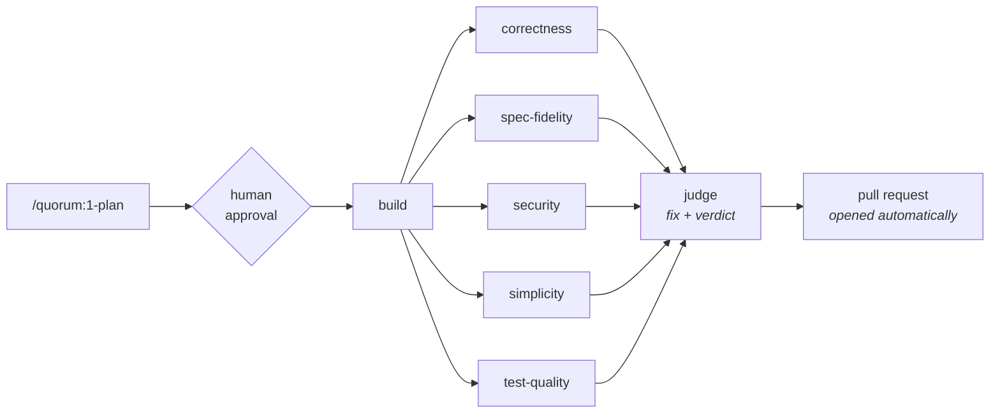

# starter

Quorum makes an AI write down what it's going to build — in terms you can actually
check — before it writes any code, then holds it to that plan mechanically instead
of asking nicely. There's no new tool to learn and no dashboard to log into: it's
slash commands in the editor you already use, and every plan, review, and verdict
is a markdown file in your own repository. All you do is approve the plan and read
the pull request, both things you already know how to do — you never have to
supervise an agent or decide when to trust one, which is the part most developers
don't understand and are right to be wary of.

A Claude Code plugin marketplace — the starter kit you pull into a repo to get a
working delivery discipline on day one, and keep for the changes after that.

Two plugins, adoptable together or separately:

| Plugin | What it gives you |
|---|---|
| **[`quorum`](plugins/quorum/)** | Plan → build → multi-lens review → adjudication → pull request. Run it step by step, or approve a plan and let it run unattended. |
| **[`tests`](plugins/tests/)** | Behavioral regression tests against the assembled application, each proven able to fail, gated in CI. |

Future repos pull these in by committing a few lines of JSON. They do not copy the
skills, and nothing needs to be installed on anyone's machine beforehand.

---

## Why this exists

The failure mode this is built against is the one where an AI session produces
plausible code, reviews its own work, agrees with itself, and reports success.
Every design decision here is aimed at breaking that loop:

- **Intent is written down before code exists**, in falsifiable terms, so there is
  something to measure the result against later.
- **Review runs in fresh context, from the diff**, so the reviewer is not anchored
  by the reasoning that produced the code.
- **Review is a panel, not an opinion** — six independent lenses, each blind to
  the others' conclusions.
- **One lens operates the software** instead of reading it. The defects a user
  hits first are often invisible in a diff, and five static readers can all pass
  while the app is visibly broken.
- **Nothing grades its own work** — not the builder, and not the judge, whose
  repair commits get their own read-only pass.
- **A judge adjudicates the panel** and is explicitly forbidden from the easy
  outs: weakening a test, narrowing the acceptance criteria, or declaring a
  criterion met when it isn't.
- **Tests must be proven able to fail.** A test that passes against broken code is
  worse than no test, because it is a merge gate you trust.
- **The rules that can be mechanical are mechanical.** A prohibition written in a
  prompt is one an agent can reason its way around. The ones a machine can settle
  are checked by a machine — and in CI, where no agent runs at all.

Once a plan is approved the whole thing runs unattended, so these stop being good
practice and start being the only safeguards there are. That is why the judge's
prohibitions are absolute rather than advisory, and why a run that ends *blocked*
with a clear reason counts as success.

### Why the pipeline is called "quorum"

The fourth step is the point of it. A single reviewer produces an opinion; a
quorum produces a decision. Step 3 deliberately generates several independent
reviews so that step 4 has a real panel to adjudicate rather than one voice to
agree with.

---

## Installing into a repo

**Nobody needs to add this marketplace by hand.** Commit this to the target repo
at `.claude/settings.json`:

```json
{
  "extraKnownMarketplaces": {
    "starter": {
      "source": {
        "source": "github",
        "repo": "AiFirstDevelopment/starter"
      }
    }
  },
  "enabledPlugins": {
    "quorum@starter": true,
    "tests@starter": true
  }
}
```

From then on, anyone who opens that repo — you on any machine, a teammate, a cloud
session, a scheduled routine — gets the skills at session start once they trust
the project. Because settings live in version control, the toolchain travels with
the repo instead of with a laptop.

That is the part that matters: skills placed in `~/.claude/skills/` are personal
to one machine and do **not** reach cloud sessions, Cowork, or routines. Plugins
enabled only in user settings don't transfer either. A repo-declared marketplace
does.

**Adopt one, not both.** `tests@starter` stands alone — a repo can take the
testing discipline without an autonomous judge, which is the right call for most
existing codebases. `quorum@starter` works without `tests`, but expects it: the
judge must run a regression suite to reach a verdict, and falls back to finding
and running it itself when `/tests:run` is unavailable.

**Pinning.** To freeze a repo against changes here, add a ref:

```json
"source": { "source": "github", "repo": "AiFirstDevelopment/starter", "ref": "v1.0.0" }
```

Omit `ref` to track the default branch and pick up improvements automatically.

**Trying it out** without committing anything:

```
/plugin marketplace add AiFirstDevelopment/starter
/plugin install quorum@starter
/plugin install tests@starter
```

---

# The `quorum` plugin



Everything from `build` rightward runs unattended inside `/quorum:pipeline`. The
same steps are also available individually — `/quorum:2-build`,
`/quorum:3-review`, `/quorum:4-quorum` — when you want to drive them by hand.
`/quorum:status` reads the artifacts on disk and tells you which one you are due
to run next.

`/quorum:pipeline` and steps 1–4 are **user-invoked only**
(`disable-model-invocation: true`). Claude will not spontaneously decide it is
time to run the judge, and it certainly will not launch a nine-agent unattended
run on its own. `/quorum:status` is model-invocable — it only reads — as are the
`tests` skills, so Claude can reach for them when it recognizes the need,
including from inside the pipeline.

## The artifact contract

The steps hand state to each other through files. That handoff is a contract, and
it is defined once in
[`plugins/quorum/reference/contract.md`](plugins/quorum/reference/contract.md)
rather than re-improvised by each skill:

```
docs/work/<slug>/
├── plan.md              # 1-plan writes it; 2-build ticks its checkboxes
├── state.json           # terse index of what has run; every step appends
├── reviews/
│   ├── 001-correctness.md
│   ├── 002-spec-fidelity.md
│   └── ...              # one file per lens, append-only
└── verdict.md           # the judge's full record
```

`<slug>` comes from an explicit argument, or from the branch name, and never from
the default branch — work happening on `main` is a signal something is wrong, not
a slug to derive. Keying artifacts to a slug rather than a fixed `docs/plan.md`
means two features in flight don't collide, and you keep the history of what was
planned and why.

**These artifacts are the record, not the interface.** The pull request is what
you read at QA time; `verdict.md` is what you open when the PR raises a question
and you want the reasoning behind it.

`state.json` is the one exception in kind: it holds no prose and decides nothing.
It is a terse index of **what has run** — stages, counts, outcomes, and the commit
SHA each stage actually inspected — written as each step finishes. The artifacts
say what was decided; they cannot say what has happened since. Both matter, and
the artifacts stay authoritative wherever the two disagree.

## `/quorum:pipeline` — the autonomous run

Takes an approved plan and delivers the change with no further human involvement.
One gate, at the start; the next thing you see is a pull request.

It runs a deterministic [workflow script](plugins/quorum/workflow/pipeline.js)
rather than improvising the orchestration, so the sequence is identical every run
and a failed run resumes instead of being re-paid for:

0. **Resolve the diff** — `/quorum:pipeline` computes the range once, in the
   shell, and hands the same one to every lens. The script has no shell; without
   this, six agents each redo the archaeology and each self-report a range nothing
   cross-checks, which quietly allows two lenses to review two different things.
1. **Build** — one agent implements the plan and commits.
2. **Review** — six lens agents run **in parallel, in fresh context**, each
   returning schema-validated findings. A genuine barrier: the judge needs all
   six at once.
3. **Record** — a write-only scribe transcribes the findings verbatim to
   `docs/work/<slug>/reviews/`.
4. **Adjudicate** — the judge verifies findings against the code, fixes the real
   ones, commits separately so the diff shows what adjudication changed, and runs
   the suite. At most **two passes**, then it stops.
5. **Recheck** — one read-only pass over **the judge's own commits**, the only
   code on the branch no lens saw. Findings are recorded and can force the PR to a
   draft; nothing fixes them here, because a fix would need its own review and the
   regress never terminates.
6. **Publish** — pushes the branch and opens the pull request, or updates the
   existing one.

Up to thirteen agents per run.

### The pull request is the deliverable

The publisher reads the verdict and writes a PR body for someone who was not
there: what the change does, **what needs a decision**, an acceptance-criteria
table with met/unmet, the review tally by lens, test status, and follow-ups. It
detects the host from the remote — `gh` for GitHub, `glab` for GitLab — and if
neither is available it prints the title, body, and command rather than failing
the run.

- Verdict `ready` or `ready with follow-ups` → PR opened ready for review
- Verdict `blocked` → **draft** PR, titled `[blocked]`, body leading with what is
  failing

A blocked run still opens a PR, because the work exists and someone needs to see
it — it just isn't inviting a merge. The publisher never merges, never approves,
never enables auto-merge, and never force-pushes. Re-running the pipeline on a
branch **updates the existing PR** rather than opening a second.

### Per branch, on demand — not per commit

The unit of work is the whole branch: the diff is measured from the fork point to
`HEAD`, the slug comes from the branch name, and the acceptance criteria describe
a finished change. Run it when the branch is ready for judgment. Running it per
commit reviews half-finished work against criteria nothing has met yet.

Running it **twice on the same branch is normal** — after more work lands, or
after a `blocked` run is unblocked. Reviews are append-only, so round two writes
`006-…` and leaves round one intact, and the approval gate fires again because
every unattended run gets its own authorization.

**Never wire it into CI or a git hook.** The judge writes code and the publisher
pushes; triggered by every push, it would commit to the branch unsupervised on top
of its own previous output with the approval gate bypassed entirely. CI runs the
regression suite (`/tests:ci`); judgment stays on demand.

### The approval gate

If the plan's *Status* isn't `approved`, you are shown Intent, Acceptance
criteria, Non-goals, and any unanswered Open questions, and asked — making clear
you are authorizing an unattended run that will write code, apply fixes, push, and
open a PR.

**Two commands hold that gate, and it is the same gate.** `/quorum:pipeline` asks
before it runs. Bare `/quorum:1-plan`, with no description after it, asks about
the plan already on disk and offers to start the pipeline when you say yes —
because coming back to an existing plan can only mean deciding about it. Approving
in one place means the other does not ask again: one decision, asked once. Being
asked twice for the same decision is not twice the safety, it is training to click
through the only checkpoint in the system.

What no command will do is approve a plan it wrote in the same breath. A plan you
are shown the instant it was generated is a rubber stamp, not a decision, so
`1-plan` writing a fresh plan tells you to read it and come back. The rule is
against approving your own new work, not against carrying a decision you actually
made.

Unanswered questions matter more here than anywhere else: after this point there
is nobody to ask, and the builder must guess and record the guess.

An authorization covers one run, and only a run that actually starts spends it.
Before the gate, the skill checks that the pipeline's five agents resolve, so a
misinstalled plugin fails in front of you instead of after you have approved. If a
run dies before the builder moves, *Status* goes back to `planned` and the gate
re-arms. And a plan found at `approved` with `state.json` still at `approved` is a
stale authorization from a run that never began — the skill asks again rather than
reading it as consent.

### Give-up conditions

An unattended pipeline must fail cleanly rather than grind or paper over:

- Suite still red after two judging passes → stops, `outcome: blocked`, draft PR
  reporting exactly what fails
- All review lenses fail → throws rather than adjudicating blind
- A single lens fails → run continues, but the missing lens is reported as an
  **unexamined dimension**, not a clean bill of health
- Any escalation or unmet criterion forces `ready with follow-ups` or `blocked` —
  never `ready`
- Publishing impossible → run still succeeds; the PR body is printed for a human

**A run that ends `blocked` with a clear reason is this pipeline working.** The
failure mode it exists to prevent is a green suite bought by deleting a test.

For how this compares to PR review bots and autonomous coding agents — and where
it is still weaker than it sounds — see [docs/comparison.md](docs/comparison.md).

## Making successive changes

This is not a greenfield tool. Most of what it runs on is a service that already
exists, and the unit of work is one change to it: plan, approve, run, read the
pull request, start the next one.

`/quorum:1-plan` is where a change begins, and it settles two things with you
before writing anything.

**The branch name.** It derives one from the substance of your request and offers
it as a default you accept or replace. The name is not decoration: it becomes the
slug, the slug becomes `docs/work/<slug>/`, and both appear in every later report
and in the pull request. Changing it afterwards means moving the artifact
directory and rewriting `state.json`, so it asks once, up front, rather than
leaving you to `git branch -m` later. It asks about the *name* only — whether to
branch is not a question, since branching is what the step is for.

**Which work item this is.** If you are standing on a branch that already carries
a plan, your request is either more of that item or the start of the next one, and
those want opposite things. More of the same revises the existing plan in place.
The next change branches from the base rather than from where you are standing —
otherwise change two stacks onto change one, burying an unreviewed change under a
new plan and leaving the slug naming work it no longer describes. When the request
does not settle which it is, you are asked rather than guessed at.

`docs/work/` accumulates one directory per change and earlier ones stay. They are
the record of what was decided and reviewed.

## The steps

### `/quorum:1-plan`

Investigates the request and writes `docs/work/<slug>/plan.md`. **Writes no code.**

Before that it settles the work branch with you — offering a derived name as a
default, and starting a fresh branch off the base when the one you are standing on
already carries a finished change. See
[Making successive changes](#making-successive-changes).

Captures **Intent**, **Acceptance criteria**, **Non-goals**, **Open questions**,
**Approach**, **Steps**, and a **Test strategy**. Acceptance criteria are the
load-bearing part — observable, falsifiable, checkable by someone who did not
write the code, by operating the assembled application. "The service layer is
refactored cleanly" is not a criterion; "when a user submits the form with an
empty email, the form stays open and shows 'Email is required'" is.

Ambiguity that would change the shape of the work becomes an **Open question** put
to you, not a silent assumption. Leaving one unanswered is expensive: it is the
question the judge will have to escalate, and an escalation costs a whole extra
cycle — the run finishes, you decide, code lands, and that code then needs its own
review round.

**The plan holds two kinds of statement, and they are not equal.** *Intent*,
*Acceptance criteria*, and *Non-goals* are **requirements** — authoritative, and
nobody but you may edit them. Everything in *Approach*, diagrams included, is a
**claim**: an assertion about the repository that the planner believed while
writing, like "`UserRepo` already exposes `findByEmail`". Claims can be false, and
a false one misdirects the builder. So they are numbered, and verifying them is
the spec-fidelity lens's defined job rather than something a reviewer might get to
on initiative.

### `/quorum:2-build`

Implements the plan, ticking each step's checkbox as it completes — which makes an
interrupted session resumable. Deviations get appended to **Build notes** as they
happen, because an unrecorded deviation reads as a defect at review time.

May not edit Intent, Acceptance criteria, or Non-goals. Scope changes are
escalated, never absorbed. Running unattended it cannot stop to ask, so a plan
that turns out to be wrong gets a loud `PLAN DEFECT` note that the reviewers read
and the judge escalates.

### `/quorum:3-review`

Produces **several independent reviews from different lenses**, each in fresh
context, each written to its own file. **Changes no code** — not even an obvious
typo — because a reviewer who edits contaminates the evidence step 4 weighs.

| Lens | Remit |
|---|---|
| `behavior` | **Launches the app and drives it as a user.** Walks each criterion by operating the real artifact, then goes off-script to catch what the change broke in passing |
| `correctness` | Logic errors, unhandled cases, races, error handling |
| `spec-fidelity` | Every acceptance criterion actually met? Anything from Non-goals built anyway? Are the plan's numbered claims true? |
| `security` | Injection, authz gaps, secret handling, data exposure, dependency risk |
| `simplicity` | Duplication, needless abstraction, dead code, missed reuse |
| `test-quality` | Do the tests fail if behavior breaks? Assertion-free tests, flakiness risk |

Every finding needs a `file:line` and a **concrete failure scenario** — inputs or
state, and the wrong result that follows. A finding that can't be stated that way
is speculation and gets dropped. Ten weak findings are worse than two real ones,
because the judge then spends its judgment filtering instead of fixing.

### `/quorum:4-quorum`

The judge. Reads the plan, the diff, and every review, then assigns each finding
exactly one disposition — **Accepted** (real, fixed), **Rejected** (with a reason),
or **Escalated** (real, but not its decision to make). It verifies findings against
the code itself, because reviewers are sometimes confidently wrong, and
independently walks every acceptance criterion, since one no lens examined can
still be unmet.

Four things it may **not** do, each closing an easy way to make a problem
disappear instead of solving it:

- weaken, skip, or delete a test to resolve a finding
- edit Intent, Acceptance criteria, or Non-goals — it doesn't move the target
- mark a criterion met when it isn't
- expand scope; real defects outside this change become recorded follow-ups

It ends by running the suite and **is not done until that suite is green**, then
writes `verdict.md`.

### `/quorum:guard`

Everything else here is a rule stated in a prompt, and a prompt is a rule an
agent can talk itself out of at 2am with a red suite and nobody awake. These are
the ones that do not depend on cooperation:

| Rule | Violation |
|---|---|
| `requirements` | *Intent*, *Acceptance criteria*, or *Non-goals* changed since planning |
| `tests` | a test file deleted, cases removed, or a new `skip` / `only` marker |
| `reviews` | an existing review file modified or deleted |
| `verdict` | `ready` over a red suite, with open escalations, or with an unmet criterion |
| `coverage` | a criterion in the plan missing from the verdict, or one the verdict invented |
| `evidence` | a criterion marked met cites a file, or a line, that does not exist |
| `branch` | work item artifacts on the default branch, or on a branch other than the one the plan was written on |
| `vendored` | `.quorum/guard.py` no longer matches the checker it was vendored from |
| `enforcement` | the vendored checker or its workflow was deleted, or one is present without the other |

`only` earns its own row: a single `it.only(...)` disables every other test in the
file while the run still reports green — the quietest way to buy a passing suite,
and invisible in a summary line reading "42 passed".

`enforcement` and `vendored` are the pair that keeps the CI half honest over a
repo's lifetime, and they cover different failures. `vendored` earns its row for
the same reason `only` does, one repo-lifetime later. CI runs
a **copy** of `guard.py`, because a CI runner has no plugin installed — and a copy
is frozen at the day it was made. Adopt at one version, update the plugin for a
year, and CI keeps enforcing the rules it started with while reporting green
throughout. A stale checker is worse than no checker, because the green tick reads
as enforcement. The comparison is on file contents rather than version numbers, so
it also catches a vendored copy somebody edited in place, and stays quiet on
releases that do not touch the checker at all.

`enforcement` covers what `vendored` structurally cannot: a checker that is
**gone**. With nothing on disk there is nothing to compare, so deleting
`.quorum/guard.py` would otherwise buy back everything the guard was refusing,
silently. It watches the diff for either file being removed — including both
going together, which is what disabling the gate actually looks like — and
separately refuses the half-installed states a diff window cannot reach: a
workflow whose checker is missing errors on every run, and a vendored checker
with no workflow runs nowhere. A repo that never vendored has neither file and
hears nothing, which is the correct answer there.

**Three layers, and only the last one is a real guarantee:**

1. **A `PreToolUse` hook** refuses any edit that would change the plan's
   requirements, at the moment it is attempted. Ticking checkboxes and editing
   *Approach*, *Steps*, or *Build notes* stay allowed. It fails open — a broken
   hook must not wedge every edit in the repo.
2. **The publisher runs the guard** before opening a PR, and a violation forces a
   draft whose body leads with it.
3. **CI runs it where no agent exists.** `--install-ci` vendors the checker to
   `.quorum/guard.py` and writes the workflow. Make `quorum guard` a **required
   status check** in branch protection and a violation blocks the merge no matter
   what the verdict claims. That last step is a repo-admin action in the hosting
   UI; until it is done, the workflow reports and nothing more.

`coverage` closes the quietest pass of all: an unmet criterion *omitted* from the
verdict reads exactly like success.

The checker has its own suite — `bin/selftest.py` breaks each rule in a throwaway
repo and asserts it fires. A merge gate that cannot be shown to fail is the exact
thing this project tells everyone else not to trust.

A guard violation is **not a finding**. Findings are claims a judge weighs and may
reject. These are rules the pipeline states it does not break, so nothing in the
pipeline is permitted to adjudicate one away.

### `/quorum:status`

Not a step — the answer to "where am I?". Reads `state.json`, the branch,
`plan.md`, the `reviews/` directory, `verdict.md`, and the working tree, then
names the state and the next command to run.

Knowing where you stand means reading five things and knowing what their
combinations mean. This does that reading.

**It leads with what completed, then with what is missing** — in that order,
always. The failure it exists to prevent is a real one: a branch whose pipeline
ran, passed, and then took one follow-up commit would get reported as "reviews
stale — run `/quorum:3-review`". True, and badly misleading. It reads as *the
pipeline did not do its job*, and it sends you to re-run a finished forty-minute
pipeline over a five-line diff.

That distinction is exactly what mtimes cannot make, which is why every stage
records the commit it inspected. "Are the reviews stale?" stops being a guess and
becomes `git log <review.head>..HEAD` — a precise list of the commits no lens has
seen, and a diffstat sizing them, so you can make the call yourself.

It **changes nothing**. A status command that repairs what it finds cannot be
trusted to report honestly, so it reports instead: a plan claiming `built` over
unticked steps, a `state.json` the artifacts contradict, a missing
lens (an unexamined dimension, not a clean bill of health), a `blocked` verdict,
or `ready` sitting beside unresolved escalations — which is a contradiction in the
judge's own output.

It departs from the artifact contract on one point, deliberately. Where the
contract says to stop and ask for a slug when the branch is the default branch,
status reports that as the state it is — naming that case is the whole point.

### `/quorum:history`

Every change this repository has planned, oldest first — the title, who planned
it, when, where it got to, and where to find its pull or merge request. Read-only.

`docs/work/` accumulates one directory per change and never loses one, so the
record already exists; this reads it back rather than adding bookkeeping.

Two columns are easy to misread, so they are worth stating plainly. **PLANNED** is
the author date of the commit that first added `plan.md`, never a file mtime — a
checkout rewrites mtimes, which is the reason `state.json` exists at all. **BY** is
that commit's git author, which is whoever's git config made the commit rather
than whoever decided the work should happen; in this pipeline the builder, judge,
and publisher all commit under the repository owner's config, so on a solo repo
it is one name repeated. Agent involvement is reported separately, from
`Co-Authored-By` trailers, because the author field cannot carry it.

The **PR** column prefers what the publisher recorded in `state.json`. Failing
that it infers one from the history — a squash merge's `(#12)`, a merge commit's
`Merge pull request #12 from …`, or GitLab's `See merge request grp/proj!12` —
and says which, because an inferred number is a lead and a recorded URL is a fact.

```bash
history.py --full        # include each plan's Intent
history.py --author ada  # by author or email
history.py --json        # for anything you want to compute over
```

### Closing an escalation

The one loop the pipeline cannot close alone. It hands back a decision, the run
ends, you decide and write the code — and that code has been reviewed by nothing.

There is **no second approval gate** for this; the plan was approved once and it
is the same work item. Re-run the pipeline over just the delta, using the commit
the judge last saw:

```
args: { slug, skipBuild: true, diffRange: "<verdict.head>...HEAD" }
```

`verdict.head` is in `state.json`. Reviews append a new round, the judge
adjudicates only what is new, and the full branch is not re-paid for.

---

# The `tests` plugin

Stands alone. A repo can adopt this without the pipeline; when both are enabled,
`/tests:add` uses the plan's acceptance criteria as its checklist.

### `/tests:add`

Writes behavioral tests against the **fully assembled application**, driven through
its outermost user-facing surface. The objective is deliberately **not** a coverage
number:

> Every behavior introduced or changed by this diff has a test that fails if that
> behavior regresses.

Coverage is a *diagnostic for finding gaps*, never the target — chasing a
percentage reliably produces assertion-free tests that execute lines without
checking anything.

It carries the Angular/DOM Testing Library philosophy across stacks as principles
rather than APIs: query the way a user perceives (accessible role, visible label,
text — never CSS classes or internal ids), assert observable outcomes rather than
internal state, never reach into internals, mock only at the true system boundary,
and name each test after the behavior in plain language. The skill maps "the UI
surface" onto web apps, HTTP APIs, CLIs, libraries, mobile apps, and queue
workers. Unit tests are reserved for pure logic that genuinely needs hardening —
parsers, date math, pricing rules, state machines.

**Fail-first verification** is the rule that makes it worth running. For every new
test: deliberately break the behavior, confirm the test fails *for the expected
reason*, then restore and confirm it passes. Any test that doesn't fail when the
behavior is broken isn't testing what you think, and gets rewritten or deleted.

Determinism is mandated throughout — frozen clocks, stubbed network, seeded
randomness, condition-waits instead of sleeps, no shared state between tests —
because flakiness is what kills a suite used as a merge gate. A suite people
re-run until it goes green isn't a gate.

### `/tests:run`

Runs the full suite. Uses a recorded recipe if the repo has one (including those
Claude Code's own `/run-skill-generator` and `/verify` produce), otherwise
discovers it — preferring the CI workflow, since that's what actually gates
merges — and then **records it** so the next run is deterministic.

The valuable part is classifying every failure, because the judge makes a
different decision for each: **code broken**, **test broken** (needs a human —
silently "fixing" the test erases the regression it was guarding),
**environment**, or **flake** (detected by re-running once, and reported as a real
defect in the suite). It modifies nothing, never reports success on a partial run
without saying so, and always surfaces skipped tests — a suite that quietly skips
is indistinguishable from one that passes.

### `/tests:ci`

Wires the suite into CI as a **required status check**, because a suite that
doesn't block merges is documentation, not a gate. Extends an existing CI config
rather than adding a competing one, keeps the job name stable (branch protection
references it by name, so a rename silently disables the gate), and never makes a
job non-blocking to get it green.

It also explains the part no file can do: branch protection is a repository
setting, so the workflow alone blocks nothing. The skill supplies the exact
`gh api` command and asks before running it. And it states what CI must *never*
run: the pipeline, the builder, or the judge — those write code.

---

## Enforcement, not just instruction

With no human in the loop, a rule written in prose is a rule a model can drift
past. The pipeline ships [agent definitions](plugins/quorum/agents/) whose tool
lists make the load-bearing constraints structural:

| Agent | Tools | Effect |
|---|---|---|
| `quorum-reviewer` | `Read, Grep, Glob, Bash` | No `Edit`, no `Write`. "Review fixes nothing" stops being a request. |
| `quorum-scribe` | `Write` | Cannot read source, so it can only transcribe findings — not editorialize about code. |
| `quorum-publisher` | `Read, Bash` | Cannot edit code or docs to tidy the presentation. |
| `quorum-builder` | default | Build rules baked into its system prompt. |
| `quorum-judge` | default | Needs full tools; the one agent that legitimately edits code. |

**Being honest about how far this goes:** removing `Edit` and `Write` closes the
easy path and the accidental path, not every path — a reviewer still has `Bash`,
which it needs to read the diff, and `Bash` can write files. This raises the cost
of drift substantially; it is not a sandbox. The reviewers also never *return* a
patch, so there is no edit for the judge to apply blindly.

Separating the scribe from the judge is deliberate too: the judge adjudicates
reviews it did not write, from files it did not author, so the record it is
weighed against isn't its own.

---

## A prompt for a new repo

Paste this into Claude Code in a repo that should adopt this workflow. It explains
the system and wires it up.

```text
This repo should adopt the "starter" Claude Code plugins. Here is what they are
and what I want you to do.

WHAT THIS IS

starter is a plugin marketplace at https://github.com/AiFirstDevelopment/starter
with two plugins.

quorum — a delivery pipeline:
  /quorum:1-plan   Settle the work branch with me — offering a name, and starting a
                   fresh one off the base when the current branch already carries a
                   finished change — then investigate the request and write
                   docs/work/<slug>/plan.md capturing Intent, falsifiable Acceptance
                   criteria, Non-goals, and Open questions. Writes no code.
                   Run bare, with no description, it instead shows me the plan
                   already on disk, asks whether I approve it, and offers to start
                   the pipeline.
  /quorum:2-build  Implement that plan, ticking off steps and recording deviations.
                   Never edits Intent, Acceptance criteria, or Non-goals.
  /quorum:3-review Review the diff in fresh context from six independent lenses
                   (behavior, correctness, spec-fidelity, security, simplicity,
                   test-quality), one file per lens under docs/work/<slug>/reviews/.
                   Fixes nothing.
  /quorum:4-quorum Judge the plan, the diff, and all reviews. Accept, reject, or
                   escalate each finding; apply accepted fixes; end with a green
                   suite; write docs/work/<slug>/verdict.md.
  /quorum:guard    Run the mechanical rule checks — requirements unchanged since
                   planning, no test weakened or deleted, reviews append-only,
                   verdict self-consistent, every criterion accounted for, cited
                   evidence real, work on the branch the plan named, and the
                   vendored CI checker present and matching — and install them as
                   a CI gate.
  /quorum:pipeline After I approve a plan, run all of that unattended and open a
                   pull request at the end. Plan approval is the only human gate.
  /quorum:status   Report which of those states this branch is in and the single
                   next command to run. Reads only; changes nothing.
  /quorum:history  List every change this repo has planned, oldest first — what it
                   was, who planned it, when, where it got to, and where to find
                   its pull or merge request. Reads only.

tests — testing discipline:
  /tests:add       Behavioral tests against the fully assembled app through its
                   outermost user-facing surface, each one proven to fail when the
                   behavior it guards is deliberately broken.
  /tests:run       Run the full suite; classify each failure as code-broken,
                   test-broken, environment, or flake.
  /tests:ci        Make the suite a required status check so PRs cannot merge red.

ITS PURPOSE

It exists to stop the loop where an AI session writes plausible code, reviews its
own work, agrees with itself, and reports success. So: intent is written down
before code exists; review happens in fresh context from the diff rather than from
the build's own reasoning; review is a panel of independent lenses rather than one
opinion; and a judge adjudicates that panel while being forbidden from weakening a
test, moving the acceptance criteria, or claiming a criterion is met when it is
not. Tests must be proven capable of failing, because a test that passes against
broken code is a merge gate you wrongly trust.

The pull request is the deliverable I read. verdict.md is the full record behind
it, for when the PR raises a question.

WHAT I WANT YOU TO DO NOW

1. Create .claude/settings.json in this repo (merge into it if it already exists):

   {
     "extraKnownMarketplaces": {
       "starter": {
         "source": { "source": "github", "repo": "AiFirstDevelopment/starter" }
       }
     },
     "enabledPlugins": { "quorum@starter": true, "tests@starter": true }
   }

2. Create docs/work/ with a .gitkeep so the artifact contract has a home.

3. Install the plugins now, so I don't have to add the marketplace by hand:

   claude plugin marketplace add AiFirstDevelopment/starter
   claude plugin install quorum@starter
   claude plugin install tests@starter
   claude plugin list

   Run these with Bash and show me the output of the last one.

4. Tell me to restart Claude Code. The install above puts the plugins on disk, but
   a running session only loads plugins at startup, so /quorum:* will not resolve
   until I restart. After restarting I should see the quorum and tests skills.

5. After I have restarted, remind me to install the CI half, which is the only
   enforcement no agent can reach:

   /quorum:guard  — then vendor it with guard.py --install-ci, commit the two
   files it writes, and make "quorum guard" a required status check in branch
   protection. That last step is a repo-admin action in the hosting UI and
   nothing here can do it; until it is ticked the workflow reports and nothing
   blocks a merge. guard.py --check-gate says which of those is true.

   Also tell me: re-run --install-ci whenever the plugin updates. The vendored
   copy is frozen at the rules it was written with, and a repo that adopted a
   year ago is otherwise still enforcing year-old rules while reporting green.

6. Then stop. Do not start any work. I will begin with /quorum:1-plan, approve the
   plan, and then run /quorum:pipeline — and again for each change after that.
```

---

## Repo layout

```
starter/
├── .claude-plugin/
│   └── marketplace.json          # the catalog: name, owner, plugins[]
├── plugins/
│   ├── quorum/
│   │   ├── .claude-plugin/plugin.json
│   │   ├── agents/               # tool-restricted agents used by the pipeline
│   │   │   ├── quorum-builder.md
│   │   │   ├── quorum-reviewer.md
│   │   │   ├── quorum-scribe.md
│   │   │   ├── quorum-judge.md
│   │   │   └── quorum-publisher.md
│   │   ├── bin/                  # the enforcement layer — no model involved
│   │   │   ├── guard.py          # the mechanical rules; vendored into CI
│   │   │   ├── history.py        # every work item ever planned, from git
│   │   │   ├── plan-lock-hook.py # PreToolUse refusal of requirement edits
│   │   │   ├── state.py          # the state.json recorder
│   │   │   └── selftest.py       # breaks every rule on purpose, asserts it fires
│   │   ├── hooks/hooks.json      # wires the plan-lock hook in
│   │   ├── workflow/pipeline.js  # deterministic orchestration
│   │   ├── reference/contract.md # the artifact contract
│   │   └── skills/
│   │       ├── pipeline/SKILL.md
│   │       ├── 1-plan/SKILL.md
│   │       ├── 2-build/SKILL.md
│   │       ├── 3-review/SKILL.md
│   │       ├── 4-quorum/SKILL.md
│   │       ├── guard/SKILL.md
│   │       ├── history/SKILL.md
│   │       └── status/SKILL.md
│   └── tests/
│       ├── .claude-plugin/plugin.json
│       ├── reference/diff-scope.md
│       └── skills/
│           ├── add/SKILL.md
│           ├── run/SKILL.md
│           └── ci/SKILL.md
└── README.md
```

## Working on the plugins

Validate before pushing — repos tracking the default branch pick up changes
immediately:

```bash
claude plugin validate .
claude plugin validate ./plugins/quorum
claude plugin validate ./plugins/tests
```

Test a change without pushing by adding the local checkout as a marketplace:

```
/plugin marketplace add ./path/to/starter
```

Changes to `workflow/pipeline.js` are worth trying against a throwaway repo first
— a bad orchestration script fails nine agents deep. Pin consuming repos to a tag
if that matters.

Adding a skill means creating `plugins/<plugin>/skills/<name>/SKILL.md` with a
`description` in its frontmatter — that description is how Claude decides when the
skill is relevant, so it should say *when to use it*, not just what it does. Add
`disable-model-invocation: true` for anything that should only ever run when you
type it. No manifest edit is needed; skills are discovered from the directory.

Adding a **plugin** means a new `plugins/<name>/` with its own
`.claude-plugin/plugin.json`, plus an entry in the marketplace `plugins[]` array.
Keep plugins coherent: one plugin should be one adoptable discipline, since that
is the unit a repo opts into.
