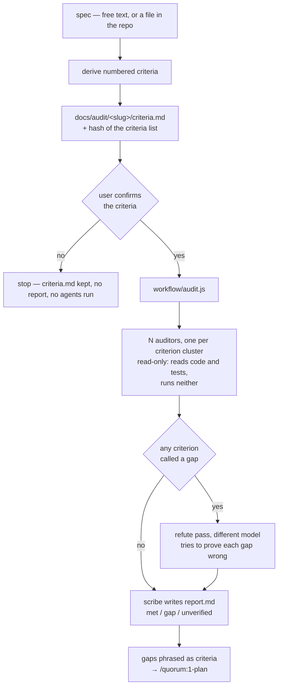

# Plan: /quorum:audit — measure an existing repo against a spec

- **Slug:** quorum-audit
- **Branch:** feature/quorum-audit
- **Status:** adjudicated

## Prompt

> I am wondering if there is a skill that we can add to the quorom plugin that
> would operate on the default branch (main, master etc).   It would work like
> the 1-plan skill by accepting a description as either free text or mention as a
> file in the repo.   It would then skip the build step and use the rest of the
> pipeline to  evaluate the implemented repo against the spec.   The results
> would be a file that contained proposed changes or an "All clear".   If there
> is more implemented than the spec then that would be fine, it is just about
> making sure that a repo implements a spec faithfully.
>
> This could be applied to a repo that did not use any of the pipeline in its
> development
>
> What do you think

Followed by "yes" — approving that the proposal be written up as a plan — and
three decisions taken at the questions below:

- Branch name: `feature/quorum-audit`.
- After deriving criteria from the spec, the skill **stops and shows them** before
  auditing, rather than running one-shot.
- Scope is **skill + workflow + agent + docs**, plus a selftest check — not
  enforcement-layer wiring, and not a skill-only version without a workflow.

## Intent

Point the quorum discipline at a repository that never used it. Given a spec —
free text, or a path to a file already in the repo — answer one question: **does
this repo faithfully implement that spec?** The deliverable is a file listing
proposed changes, or "All clear".

The user's constraint, in their words: "If there is more implemented than the spec
then that would be fine, it is just about making sure that a repo implements a
spec faithfully." Implementation beyond the spec is never a finding.

It must be safe to run on the default branch, which is what the rest of the
pipeline is not. That safety comes from the command writing no code at all — it
proposes, it never fixes — so there is nothing for an approval gate to protect and
nothing that can damage `main`.

## Acceptance criteria

- [ ] AC1: When `/quorum:audit` runs to completion on `main` in a repository with
      no quorum artifacts, it creates no branch, switches no branch, makes no
      commit, and `git status --porcelain` afterwards lists changed paths only
      under `docs/audit/`.
- [ ] AC2: `/quorum:audit <free text>` and `/quorum:audit <path/to/spec.md>` both
      produce `docs/audit/<slug>/criteria.md`. Given an argument that looks like a
      path but names no existing file, the command says so and writes nothing,
      rather than silently auditing against the path string as prose.
- [ ] AC3: Every criterion in `criteria.md` cites where in the spec it came from —
      a quoted phrase, or a heading and line reference. A criterion that cites
      nothing is not written.
- [ ] AC4: The command shows the derived criteria and stops. On anything short of
      a clear yes, `docs/audit/<slug>/` contains `criteria.md` and no `report.md`,
      and no auditing agent has run.
- [ ] AC5: `criteria.md` records a hash over its own criteria list, `report.md`
      cites that hash, and the two match — so a report audited against criteria
      that were softened mid-run is detectable by re-hashing the file.
- [ ] AC6: Every criterion appears in `report.md` with exactly one status: `met`,
      `gap`, or `unverified`. A criterion the audit could not settle from code and
      tests alone — it turns on runtime behaviour, or the area was outside the
      requested scope — is `unverified` with the reason stated, never `met` and
      never absent. When every criterion is `met`, the report's Outcome line reads
      `All clear` and its Gaps section is empty.
- [ ] AC7: Behaviour present in the repository but absent from the spec appears
      nowhere in `report.md` — not as a gap, not as a finding, not as a
      recommendation to remove it.
- [ ] AC8: Every `gap` in `report.md` names the searches that came back empty —
      the patterns and the paths — so a reader can re-run them and disagree.
- [ ] AC9: Every `gap` is phrased as an observable criterion in the form
      `/quorum:1-plan` can consume, and `report.md` ends by naming the
      `/quorum:1-plan` invocation that takes the report as its input.
- [ ] AC10: `python3 plugins/quorum/bin/selftest.py` exits 0, and fails when
      `workflow/audit.js` names an agent that does not register under exactly that
      name, or names an agent whose definition grants a file-editing tool.
- [ ] AC11: The audit never executes code belonging to the repository under audit
      — not its application, not its build, not its test suite, not a script it
      ships. The shell is used only to search and read. A criterion that could
      only be settled by running the software is reported `unverified` with that
      as the reason, never `gap` — absence of runtime evidence is not evidence of
      absence.

## Non-goals

- **Fixing anything.** The audit proposes changes; it never edits source, commits,
  pushes, or opens a pull request. This is what makes it safe on `main`.
- **Running the audited software.** The audit never launches the application,
  builds it, or runs its tests. The target is production code: a spec check has no
  business starting a process that may hold live credentials, run a migration on
  boot, or begin consuming from a real queue. What this costs is stated in
  *Approach* rather than hidden.
- **General code review.** The correctness, security, and simplicity lenses are
  not run. A defect unrelated to the spec is out of scope — `/code-review` and
  `/quorum:3-review` cover that ground, and mixing them buries the spec gaps.
- **Reporting extra implementation as a problem**, in any form.
- **Teaching `/quorum:status`, `/quorum:history`, `guard.py`, or the plan-lock
  hook about `docs/audit/`.** They key off `docs/work/` and stay unchanged.
- **Wiring the audit into CI as a gate.**
- **Changing the existing four steps, `pipeline.js`, the agents they use, or the
  `docs/work/` artifact contract.**
- **Specs that live outside the repository** — a URL, a ticket, a wiki page. Free
  text pasted into the command covers that case well enough for now.
- **Auditing more than one repository at a time.**

## Open questions

None. The three forks that would have changed the shape of this work — the
criteria gate, the scope, and the branch name — were settled before this plan was
written and are recorded under *Prompt*.

## Approach

### The shape

### Why the work splits between a skill and a workflow

The skill has a shell and a user; the workflow has neither and cannot ask
anything. So the halves divide on that line, exactly as `1-plan` divides from
`pipeline`: **deriving criteria and holding the gate happen in the skill**, and
everything after the user says yes happens in `audit.js`. Resolving the spec once
in the skill also means every auditor is handed the same criteria, the same way
`/quorum:pipeline` resolves the diff range once so six lenses demonstrably read
the same change.

### New files

- `plugins/quorum/skills/audit/SKILL.md` — resolves the spec argument (path vs
  free text), derives numbered criteria with citations, writes `criteria.md`,
  holds the gate, launches `audit.js`, and reports what came back.
- `plugins/quorum/workflow/audit.js` — the deterministic sequence: cluster the
  criteria, fan out read-only auditors, run one behaviour pass, refute every
  claimed gap on a different model, then have the scribe write `report.md`.
- `plugins/quorum/agents/quorum-auditor.md` — read-only (`Read, Grep, Glob,
  Bash`), used for all three of those passes. Its standing obligation is the one
  the reviewer agent does not carry: **a claim that something is absent must name
  the searches that came back empty.**
- `plugins/quorum/reference/audit.md` — the `docs/audit/<slug>/` layout, the
  `criteria.md` and `report.md` formats, and the `met` / `gap` / `unverified`
  vocabulary. A separate file from `contract.md` so the pipeline's agents do not
  read audit material they will never use.
- `plugins/quorum/bin/audit.py` — hashes and verifies the criteria list (AC5).
  Deliberately **not** a flag on `guard.py`: that file is vendored into consuming
  repos and version-checked for drift, so every change to it obliges every adopter
  to re-vendor. An audit helper has no business forcing that.

### Modified files

- `plugins/quorum/bin/selftest.py` — generalise `test_agents()` to scan both
  workflow scripts, and add the no-write-tools assertion for audit agents.
- `README.md` — a `### /quorum:audit` section (beside `status`, `history`, and
  `guard`, since it is not a numbered step), the repo-layout tree, and the command
  list in the adoption prompt.
- `plugins/quorum/README.md` — one line.
- `plugins/quorum/.claude-plugin/plugin.json` and `.claude-plugin/marketplace.json`
  — version bump, kept in step.

### Decisions worth stating

**Reuse `quorum-scribe` for the report.** It is write-only and transcribes
verbatim, which is exactly right for turning structured findings into
`report.md` — the same role it plays for review files.

**One new agent, not two.** Auditing, observing, and refuting are the same
read-only job under different prompts. `audit.js` decorrelates the refute pass by
**model** instead, on the reasoning `pipeline.js` already applies to the judge and
its recheck: the same weights checking their own conclusion see the same things.

**Negative evidence is the quality risk, and the refute pass is the answer to
it.** In a diff review a finding is a positive claim with a file and a line. Here
most findings are absences, and "I looked and did not find it" is far easier to
get wrong. Every claimed gap is therefore put to an agent whose job is to prove it
wrong before it reaches the report.

**The audit is static, and that costs something real.** An earlier draft ran a
pass that launched the application and drove it, on the reasoning that observed
behaviour beats inferred behaviour and catches what code review cannot — a
requirement the code appears to satisfy and the running system does not. That is
given up deliberately, because the target is production code and the alternative
made a production system's safety depend on an agent correctly judging that
launching was safe. This plugin exists to distrust exactly that kind of judgment.

The honest consequence: **this audit can tell you the code appears to implement a
requirement; it cannot tell you the software does.** Criteria that turn on runtime
behaviour come back `unverified`, and the report says so in those words rather
than rounding them up to `met`.

**Claims** — assertions about this repository that the approach rests on:

- [ ] C1: Skills are discovered from `plugins/quorum/skills/<name>/SKILL.md` with
      no manifest edit (README, *Working on the plugins*).
- [ ] C2: A workflow script addresses plugin agents by namespaced name,
      `quorum:<agent>` (`workflow/pipeline.js`, and the comment above its agent
      calls).
- [ ] C3: `selftest.py:1053` asserts every agent declared in `agents/` is
      referenced by `pipeline.js`. **Adding `quorum-auditor.md` therefore turns
      the suite red until `test_agents()` is generalised** — so S5 cannot be
      deferred past S2 without leaving the branch red in between.
- [ ] C4: `guard.py`, `history.py`, `watch.py`, the `status` skill, and
      `plan-lock-hook.py` all key off `docs/work/`; `plan-lock-hook.py:35` matches
      `docs/work/<slug>/plan.md` specifically. A `docs/audit/` tree is invisible to
      all of them with no change.
- [ ] C5: Nothing in the plugin currently reads or writes `docs/audit/`.
- [ ] C6: The Workflow tool supplies `agent()` with per-call `agentType`, `model`,
      `schema`, and `phase`, plus `parallel()` and `pipeline()` — `pipeline.js`
      uses all of them.
- [ ] C7: `plugins/quorum/.claude-plugin/plugin.json` and
      `.claude-plugin/marketplace.json` both carry version `0.23.0` today and are
      kept in step.
- [ ] C8: This repository's whole regression suite is
      `python3 plugins/quorum/bin/selftest.py`, run in CI by
      `.github/workflows/selftest.yml`. There is no other test runner.

## Steps

- [x] S1: Write `reference/audit.md` — the `docs/audit/<slug>/` layout, the
      `criteria.md` and `report.md` formats, and the status vocabulary. Everything
      after this references it rather than restating it.
- [x] S2: Add `agents/quorum-auditor.md` — read-only tools, the negative-evidence
      obligation, and the refutation posture.
- [x] S3: Generalise `selftest.py`'s `test_agents()` to scan every script in
      `workflow/`, and assert that agents named by `audit.js` grant no
      file-editing tools. Lands with S2 per claim C3; the suite is red between
      them.
- [x] S4: Add `bin/audit.py` — hash and verify the criteria list — and cover it in
      `selftest.py`.
- [x] S5: Write `workflow/audit.js` — cluster, fan out, refute, transcribe, with
      schemas for each pass. No pass launches the repository under audit.
- [x] S6: Write `skills/audit/SKILL.md` — spec resolution, criteria derivation,
      the hash, the gate, the launch, and the report.
- [x] S7: Update `README.md`, `plugins/quorum/README.md`, and both version fields;
      run `claude plugin validate .` and `./plugins/quorum`.

## Test strategy

This repository's suite is `python3 plugins/quorum/bin/selftest.py` — it builds
throwaway repos, breaks each rule on purpose, and checks that the rule fires.
There is no other runner (C8), and the honest split is:

**Mechanically tested, in `selftest.py`:**

- AC10 directly — the generalised agent-name check over `workflow/audit.js`, plus
  the assertion that every agent it names grants no `Write`/`Edit`. This is the
  failure the existing check exists for, and it has already cost two runs.
- AC5 — `bin/audit.py` hashing is pure and testable: a criteria file, a softened
  copy, and the assertion that the hashes differ and that verification fails.

**Verified by operating the command, not by a unit test:** AC1, AC2, AC3, AC4,
AC6, AC7, AC8, AC9, AC11. These are properties of what a prompt causes to happen, and
the way to check them is the `behavior` lens driving `/quorum:audit` against a
**fixture repository** — a spec and an implementation arranged so that every
criterion's correct status is fixed in advance, and the report can be compared
against it rather than merely read for plausibility. It needs one criterion the
code genuinely meets, one it genuinely does not, and one piece of behaviour the
spec never mentions, so AC6, AC8, and AC7 each have something to be wrong about.
Whether the fixture is disposable or committed is a build-time decision; what it
must be is controlled. Claiming unit coverage for these would be claiming coverage
that does not exist.

## Build notes

All seven steps landed. `python3 plugins/quorum/bin/selftest.py` — this
repository's whole suite (C8) — is **green at 207/207**, up from 184 before the
change. `claude plugin validate .` and `claude plugin validate ./plugins/quorum`
both pass. `guard.py --work-dir docs/work/quorum-audit` is clean.

### PLAN DEFECT — AC10 contradicts the plan's own *Approach*

**What is wrong.** AC10 requires that `selftest.py` exits 0 **and** that it fails
when `workflow/audit.js` "names an agent whose definition grants a file-editing
tool". *Approach* ("Reuse `quorum-scribe` for the report") and S5 ("then have the
scribe write `report.md`") both require `audit.js` to name
`quorum:quorum-scribe`, whose definition grants `Write` — a file-editing tool.
Both cannot hold at once: implementing AC10 literally turns the suite red on the
plan's own design. Something has to write `report.md`, `audit.js` has no shell
and no file tools of its own, so an agent must, and every candidate grants a
write tool by definition.

**What I did.** Implemented the check over every agent `audit.js` names, with
exactly one exemption, `quorum-scribe`, named in a constant rather than inferred
— and made the exemption itself mechanically constrained so it cannot be widened:
the scribe must be **write-only**, granting a write tool and no read tool. The
moment anyone grants it `Read`, `Grep`, `Glob`, or `Bash` it stops qualifying and
the check fires. An agent declaring no `tools:` field at all fails too, since it
inherits everything, file editing included.

Four probes against a scratch copy of the plugin confirm each failure fires:
`audit.js` naming an unregistered agent; `quorum-auditor` granted `Write`;
`quorum-scribe` granted `Read`; `audit.js` deleted. Each produced exactly one
targeted FAIL and no others.

**What I think should happen.** The property worth protecting is that *nothing
which can read the audited repository can write to it*, and AC10's wording
overshoots it into self-contradiction. It should read something like "names an
agent that can both read the repository under audit and edit it", or keep the
current wording with the write-only scribe carved out. This is a wording
decision on an acceptance criterion, so I have not touched it — the judge should
settle it.

### PLAN DEFECT — S5 and *Approach* ask for a behaviour pass the requirements forbid

**What is wrong.** The *New files* entry for `audit.js` says it runs "cluster the
criteria, fan out read-only auditors, **run one behaviour pass**, refute every
claimed gap...". A behaviour pass means launching the audited software, which
AC11 forbids outright, which *Non-goals* lists as "Running the audited software",
which the *Approach* diagram does not contain, and which *Decisions worth
stating* records as deliberately given up ("An earlier draft ran a pass that
launched the application ... That is given up deliberately"). `state.json`'s log
records the same: "behavior pass dropped, AC11 added".

**What I did.** No behaviour pass. `audit.js` is cluster → audit → refute →
report, exactly the four phases the diagram shows. Requirements outrank a stale
line in *Approach*, and every prompt in the script carries the
never-execute-the-repository constraint verbatim.

**What I think should happen.** Strike "run one behaviour pass" from that bullet.
It is a leftover from the superseded draft and nothing else in the plan supports
it.

### Deviations

- **A gap that names no searches is recorded as `unverified`, not as a gap.**
  AC8 requires every gap in `report.md` to name the searches that came back
  empty, and a schema cannot make one field conditional on another's value. So
  `audit.js` enforces it after the fact: a `gap` whose auditor recorded no
  `searched` value is downgraded to `unverified`, with the original note
  preserved verbatim in the evidence. Downgraded rather than dropped, because
  dropping it would break AC6 — the criterion was still not shown to be met, and
  a criterion missing from a report reads exactly like one that passed. The plan
  does not describe this; it is what AC8 and AC6 together force.

- **Cluster assignment is deduplicated and swept.** The plan says "cluster the
  criteria" and stops there. Two failures follow from a clustering agent and only
  one is visible: a criterion in no cluster is never audited, and a criterion in
  two gets two answers that can disagree. `audit.js` therefore assigns each
  criterion to the first cluster that claims it, sweeps anything unassigned into
  an explicit `unclustered` cluster, and records any criterion no auditor
  returned as `unverified` with that as its stated reason. AC6 ("never absent")
  cannot hold without this.

- **A committed fixture, not a disposable one.** *Test strategy* leaves
  "whether the fixture is disposable or committed" as a build-time decision but
  requires that it be **controlled** — every criterion's correct status fixed in
  advance. A fixture the reviewer invents at review time is by definition not
  controlled in advance, so I committed one: `docs/fixtures/audit-demo/` is a
  small HTTP service and its spec, with one criterion the code genuinely meets,
  one it genuinely does not (no retry anywhere), one that turns on runtime timing
  and can only be `unverified`, and two features the spec never mentions (a rate
  limiter and `/metrics`) so AC7 has something to be wrong about. The answer key
  lives at `docs/fixtures/README.md`, **outside** the fixture tree, so an auditor
  searching the repository under audit cannot read it. This adds a directory the
  plan's *New files* does not list; it is the option *Test strategy* contemplates
  rather than new scope. `README.md`'s repo-layout tree names it.

- **`README.md` gained more than the plan's three edits.** The plan names a
  `### /quorum:audit` section, the layout tree, and the adoption prompt's command
  list. The layout tree edit also restructured the `workflow/` and `reference/`
  entries from single-file lines into directories, because both now hold two
  files. Same section, unavoidable.

### Claims checked against the repository

- **C6 is false in one detail.** `pipeline.js` uses `agent()`, `parallel()`,
  `phase()`, and `log()`. It does **not** use `pipeline()`; there is no such call
  in the file. Nothing depended on it — `audit.js` uses the same four primitives
  `pipeline.js` actually uses.
- **C4's line reference is off.** `plan-lock-hook.py` matches
  `docs/work/<slug>/plan.md` at **line 25**, not line 35. The substance holds:
  `guard.py`, `history.py`, `watch.py`, the `status` skill, and the hook all key
  off `docs/work/`, and `docs/audit/` is invisible to every one of them with no
  change.
- C1, C2, C3, C5, C7, C8 all held as written. C3 was exact: adding
  `quorum-auditor.md` turned the suite red at
  `selftest.py:1053` until `test_agents()` was generalised.

### Worth knowing

- **The suite is red between S3 and S5 as well as between S2 and S3.** C3
  predicts the first window. The second follows from S3's assertion that
  `audit.js` exists to be checked, which cannot pass before S5 writes it. I kept
  the existence check rather than making it tolerant of a missing file: a check
  that skips when the script is absent would let deleting `audit.js` silently
  disable the read-only guarantee, which is the failure the check exists for.
  Both windows are closed and the final suite is green.
- **`bin/audit.py` copies `guard.py`'s `sections()` rather than importing it.**
  Fifteen duplicated lines, deliberately: the criteria hash has to mean the same
  thing in a year, and `guard.py` is the vendored, drift-checked file that moves
  on its own schedule. An import would let an unrelated change there silently
  restate every audit's recorded hash. The reasoning is in the source, at the
  function.

### Deliberately left out

- **Nothing operates `/quorum:audit` end to end in this branch.** AC1, AC2, AC3,
  AC4, AC6, AC7, AC8, AC9, and AC11 are properties of what a prompt causes to
  happen, and *Test strategy* assigns them to the `behavior` lens driving the
  command against the fixture — not to `selftest.py`. The fixture is committed
  and its answer key written, so that lens has something controlled to compare
  against; the run itself belongs to `/quorum:3-review`. AC5 and AC10 are the two
  that are mechanically covered, as the plan says.
- Nothing was taught about `docs/audit/` — not `/quorum:status`,
  `/quorum:history`, `guard.py`, `watch.py`, or the plan-lock hook. Non-goal, and
  the `audit` skill says so where a user would otherwise expect a watcher.
- No CI wiring for the audit, no enforcement-layer changes, and no change to the
  four numbered steps, `pipeline.js`, or the `docs/work/` contract.
