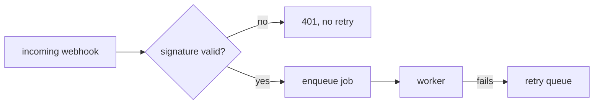

# Step 1 — Plan

Turn a change request into a written plan that the rest of the pipeline can be
measured against. **You write no production code in this step.**

Read `${CLAUDE_PLUGIN_ROOT}/reference/contract.md` first — it defines the slug
rules and file layout you must follow.

## Why this step exists

Step 4 (`/quorum:4-quorum`) has to judge whether the delivered code fulfills the
user's intent. It can only do that if the intent was written down, in testable
terms, before the code existed. A plan that is only a task list makes step 4
impossible. **Acceptance criteria are the load-bearing part of this document —
everything else is supporting material.**

## One deliberate deviation from the contract

The contract says to stop and ask for a slug when the branch is the default
branch. **Do not stop here.** Standing on `main` with a change in mind and no
branch yet is how a work item normally starts. Name the branch, create it, and
carry on. The contract's rule exists to keep pipeline artifacts from being
written against a slug derived from `main` — creating the branch honours that
rule rather than breaking it.

This is the only step that may create a branch. Every later step still stops.

## Procedure

1. **Establish the branch.** Run `git branch --show-current`.

   - **Already on a feature branch** — use it. Resolve the slug from it per the
     contract. Do not rename it to something you like better.

   - **On `main` or `master`** — derive a name from the request and create the
     branch before writing anything:

     ```bash
     git checkout -b feature/<name>
     ```

     Take `<name>` from the substance of the request rather than its phrasing:
     two to four kebab-case words a reviewer would recognise in a branch list.
     `retry-failed-webhooks`, not `updates` or `new-code`. Use `fix/` when the
     request repairs broken behaviour, `chore/` for maintenance with no
     user-visible effect, `feature/` otherwise. If the request names a ticket,
     lead with it — `feature/proj-12-add-login`. Never invent a ticket number.

     Create it and say which name you chose; do not ask permission first. The
     branch costs nothing and `git branch -m <better-name>` renames it. This
     works on a repository with no commits yet. Uncommitted work follows you onto
     the new branch — do not commit, stash, or discard it to tidy up first.

     If the name is taken, switch to that branch only when it is plainly the same
     work item; otherwise choose a more specific name.

   - **Not a git repository, or git is unavailable** — do not fabricate a slug.
     Report it and ask the user, per the contract.

2. **Resolve the slug** per the contract. If `docs/work/<slug>/plan.md` already
   exists, do not silently overwrite it. Report it and ask whether to revise the
   existing plan or start a new work item under a different slug.

3. **Investigate before planning.** Read the code the change touches. Identify
   the existing patterns, the test setup, the build and run commands. A plan
   written without reading the repo will propose things that do not fit it.

4. **Surface unknowns as questions, not assumptions.** If the request is
   ambiguous in a way that would change the shape of the work, put it in *Open
   questions* and ask the user directly before finishing. Make routine judgment
   calls yourself; escalate only forks that lead to materially different work.

5. **Write `docs/work/<slug>/plan.md`** using the template below. Where a
   diagram would carry the design better than a paragraph, draw one in mermaid
   — see *Diagrams*.

6. **Stop.** Report the path and summarize the acceptance criteria and any open
   questions. Do not begin building.

   The user then either drives the steps by hand (`/quorum:2-build`,
   `/quorum:3-review`, `/quorum:4-quorum`) or runs `/quorum:pipeline`, which
   executes all of it unattended. **Assume the latter.** Plan approval is the last
   human checkpoint, so anything you leave vague is something a builder will have
   to guess at with nobody to ask.

## Template

````markdown
# Plan: <short title>

- **Slug:** <slug>
- **Branch:** <branch>
- **Status:** planned

## Intent

What the user is actually trying to achieve, in their terms — the outcome, not
the implementation. Two to five sentences. If the user gave a reason or a
constraint, capture it here verbatim rather than paraphrasing it away.

## Acceptance criteria

Observable, testable statements. Each one must be checkable by someone who did
not write the code, by operating the assembled application. Prefer the form
"when <situation>, <observable result>".

- [ ] AC1: ...
- [ ] AC2: ...

Bad: "the service layer is refactored cleanly."
Good: "when a user submits the form with an empty email, the form stays open and
shows 'Email is required' next to the email field."

## Non-goals

Explicitly out of scope. This section prevents step 2 from expanding the work and
step 4 from penalizing the absence of things nobody asked for.

- ...

## Open questions

Anything unresolved, with the assumption being made in the meantime so work is
not blocked. Empty is fine — but only if it is genuinely empty.

- **Q:** ... **Assumption:** ...

## Approach

The intended implementation, at the level of files and responsibilities. Name the
existing patterns being followed. Call out anything risky or irreversible.

Include a mermaid diagram here when the change has a shape prose describes
poorly — see *Diagrams* below. Omit the diagram entirely when it would only
restate the paragraph above it.



## Steps

Ordered and small enough to verify individually. `/quorum:2-build` ticks these
off as it goes, so a dead session can be resumed by reading this list.

- [ ] S1: ...
- [ ] S2: ...

## Test strategy

Which acceptance criteria get behavioral tests through the assembled application,
and which pure logic (if any) warrants unit tests. See `/tests:add`.

## Build notes

Left empty by this step. `/quorum:2-build` appends deviations here.
````

## Diagrams

Plans are read by a builder, by reviewers, and by whoever adjudicates the result.
A mermaid diagram is worth including when it shows something the prose would
otherwise ask the reader to hold in their head. GitHub and most markdown viewers
render fenced ```` ```mermaid ```` blocks, so no tooling is needed.

Reach for one when the change involves:

- **Control flow with branches** — `flowchart`. Especially failure paths and the
  conditions that lead to them.
- **Two or more components talking** — `sequenceDiagram`. Requests crossing a
  service boundary, retries, callbacks, anything where ordering matters.
- **A lifecycle or status field** — `stateDiagram-v2`. Which transitions are
  legal, and which are deliberately not.
- **New or reshaped persisted data** — `erDiagram`. Only when relationships or
  cardinality change; a single added column is not a diagram.

Keep them honest:

- The diagram supplements the acceptance criteria; it never replaces them. A
  reviewer must still be able to check every AC from its text alone.
- Roughly a dozen nodes is the ceiling. Past that, split it or cut it — an
  unreadable diagram is worse than none.
- Label the edges. `A --> B` says nothing an arrow in prose would not.
- Diagram what the change makes true, not the current state, unless you say
  explicitly which one you are showing. A before/after pair is fine when the
  point of the work is the difference between them.
- If the diagram and the prose disagree, the plan is wrong somewhere. Fix both.

A three-line change gets no diagram. Do not draw one to look thorough.

## Status lifecycle

*Status* moves `planned` → `approved` → `built` → `adjudicated`. You write
`planned`. Only the user approves, via `/quorum:pipeline`'s approval gate or by
editing the plan. **Never write `approved` yourself** — a plan that approves
itself defeats the only checkpoint in the system.

## Rules

- No production code, no test code, no dependency changes in this step.
- Creating the work branch is the only write to git this step makes. No
  commits, no pushes, no rebases — the branch starts empty on purpose.
- Every acceptance criterion must be falsifiable. If you cannot describe how it
  would be observed failing, it is not an acceptance criterion — rewrite it.
- Do not pad the plan. A three-line change gets a short plan.
