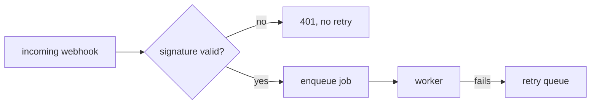

# Step 1 — Plan

Turn a change request into a written plan that the rest of the pipeline can be
measured against. **You write no production code in this step.**

Read `${CLAUDE_PLUGIN_ROOT}/reference/contract.md` first — it defines the slug
rules and file layout you must follow.

## Why this step exists

Step 4 (`/quorum:4-quorum`) has to judge whether the delivered code fulfills the
user's intent. It can only do that if the intent was written down, in testable
terms, before the code existed. A plan that is only a task list makes step 4
impossible. **Acceptance criteria are the load-bearing part of this document —
everything else is supporting material.**

## Two deliberate deviations from the contract

The contract says to stop and ask for a slug when the branch is the default
branch. **Do not stop here.** Standing on `main` with a change in mind and no
branch yet is how a work item normally starts. Name the branch, create it, and
carry on. The contract's rule exists to keep pipeline artifacts from being
written against a slug derived from `main` — creating the branch honours that
rule rather than breaking it.

The contract also says later steps reuse the slug an earlier step resolved. **This
step may decide the branch you are standing on is the wrong one** and start the
work item somewhere else. That is what the second change to a repository looks
like, and once a service exists most changes are that.

This is the only step that may create or switch a branch. Every later step still
stops.

## Called with no description

`/quorum:1-plan` with nothing after it is not a request to plan something. There
is nothing to plan. It means the user has come back to a plan that already exists,
and the only useful thing to do with an existing plan is decide about it.

So: resolve the slug, read `docs/work/<slug>/plan.md`, and **hold the approval
gate here** rather than sending them to another command to be asked the same
question.

1. If no plan exists for this slug, say so and ask what they want built. There is
   nothing to approve and nothing to plan from.

2. If the plan's *Status* is already past `planned`, do not re-ask. Report where
   it stands and point at `/quorum:status`.

3. Otherwise show **Intent**, **Acceptance criteria**, **Non-goals**, and any
   unanswered **Open questions**, then ask plainly whether to proceed. Make clear
   what approval authorizes: an unattended run that will write code, review it,
   apply fixes, and open a pull request with no further checkpoint.

   Surface unanswered *Open questions* now. After this there is nobody to ask, and
   the builder has to guess and record the guess.

4. On approval — and only on clear approval — set *Status* to `approved` and
   record it:

   ```bash
   python3 "${CLAUDE_PLUGIN_ROOT}/bin/state.py" docs/work/<slug> \
     '{"stage":"approved","log":"plan approved by user via 1-plan"}'
   ```

   Then **offer to start the pipeline**, and run `/quorum:pipeline` if they say
   yes. It will not ask again: a plan at `approved` whose recorded stage is also
   `approved` is an authorization nobody has spent yet, which is exactly this.

   On anything short of clear approval, stop and change nothing.

## Procedure

1. **Establish the branch.** Two decisions, in this order: *which work item is
   this*, then *what is it called*. Taken the other way round you name a branch
   well and still write the plan into the previous change's directory.

   Start from `git branch --show-current`.

   **a. Which work item is this?**

   - **On `main` or `master`** — a new work item. Go to (b).

   - **On a work branch with no `docs/work/<slug>/plan.md`** — a branch made by
     hand for exactly this. Use it as it stands, skip (b), and do not rename it
     to something you like better.

   - **On a work branch that already has `docs/work/<slug>/plan.md`** — the
     branch is carrying a work item, and the request is one of two things.
     Compare it against that plan's *Intent*, not against its file names:

     - **More of the same item** — the request extends, corrects, or finishes
       what the plan describes. Stay where you are and revise that plan rather
       than writing a second one beside it. Say that is what you are doing.

     - **The next change** — a different piece of work. This is the ordinary case
       once a service exists, and the one that goes wrong quietly: stacking
       change two onto change one's branch buries an unreviewed change under a
       new plan, and leaves the slug naming work it no longer describes. Branch
       from the base rather than from where you are standing, and go to (b):

       ```bash
       BASE=$(git symbolic-ref --quiet refs/remotes/origin/HEAD 2>/dev/null | sed 's@.*/@@')
       BASE=${BASE:-main}
       git checkout -b <new-branch> "origin/$BASE"
       ```

       If there is no `origin/<base>` — no remote, or a repository never pushed —
       branch from the local base instead (`git checkout -b <new-branch> main`).

       Say which base you branched from. If the previous item is not merged yet,
       say that too — the new branch will not contain it, and the user may have
       been expecting to build on top of it.

     If the request does not settle which of the two it is, ask. Guessing wrong
     costs a branch in one direction and a buried change in the other.

   **b. Name it.** Derive a default from the substance of the request rather than
   its phrasing: two to four kebab-case words a reviewer would recognise in a
   branch list. `retry-failed-webhooks`, not `updates` or `new-code`. Use `fix/`
   when the request repairs broken behaviour, `chore/` for maintenance with no
   user-visible effect, `feature/` otherwise. If the request names a ticket, lead
   with it — `feature/proj-12-add-login`. Never invent a ticket number.

   **Then offer that default and let the user take it or replace it.** One
   question, asked before anything is written, with your derived name as the
   default so that accepting it costs a keystroke.

   Ask about the *name*, not about whether to branch at all — branching is what
   this step is for, and a branch nobody wanted is undone with `git branch -d`.
   The name is worth the question because it is not just a label: it becomes the
   slug, the slug becomes `docs/work/<slug>/`, and both appear in every later
   report and in the pull request. Changing it afterwards means moving the
   artifact directory and rewriting `state.json`, so it is cheaper to ask now
   than to rename later.

   ```bash
   git checkout -b feature/<name>
   ```

   This works on a repository with no commits yet. Uncommitted work follows you
   onto the new branch — do not commit, stash, or discard it to tidy up first.

   If the name is taken, say so and offer a more specific one. Switch to the
   existing branch only when it is plainly the same work item.

   **c. Not a git repository, or git is unavailable** — do not fabricate a slug.
   Report it and ask the user, per the contract.

2. **Resolve the slug** per the contract; it follows from the branch you settled
   in step 1. `docs/work/<slug>/plan.md` should not exist at this point — step 1
   is where that case is decided. If it does exist and you did not deliberately
   choose to revise it, stop rather than overwrite it.

3. **Investigate before planning.** Read the code the change touches. Identify
   the existing patterns, the test setup, the build and run commands. A plan
   written without reading the repo will propose things that do not fit it.

4. **Surface unknowns as questions, not assumptions.** If the request is
   ambiguous in a way that would change the shape of the work, put it in *Open
   questions* and ask the user directly before finishing. Make routine judgment
   calls yourself; escalate only forks that lead to materially different work.

5. **Write `docs/work/<slug>/plan.md`** using the template below. Where a
   diagram would carry the design better than a paragraph, draw one in mermaid
   — see *Diagrams*.

6. **Record the state** per the contract, so `/quorum:status` can report what has
   run without inferring it:

   ```bash
   HASH=$(python3 "${CLAUDE_PLUGIN_ROOT}/bin/guard.py" --hash docs/work/<slug>/plan.md)
   python3 "${CLAUDE_PLUGIN_ROOT}/bin/state.py" docs/work/<slug> \
     '{"slug":"<slug>","branch":"<branch>","stage":"planned",
       "plan":{"acs":4,"steps":6,"open":1,"requirementsHash":"'"$HASH"'"},
       "log":"1-plan planned 4 ACs, 6 steps, 1 open question"}'
   ```

   `requirementsHash` fingerprints *Intent*, *Acceptance criteria*, and
   *Non-goals*. Recording it here is what lets `/quorum:guard` prove later that
   nobody moved the target — including you. Record it **after** the plan's
   requirements are final, and never re-record it to make a later check pass.

7. **Stop.** Report the path and summarize the acceptance criteria and any open
   questions. Do not begin building.

   Do not ask them to approve it now. You wrote it moments ago; a decision taken
   in that breath is a rubber stamp. Tell them to read it and come back — bare
   `/quorum:1-plan` will hold the gate, or `/quorum:pipeline` will.

   The user then either drives the steps by hand (`/quorum:2-build`,
   `/quorum:3-review`, `/quorum:4-quorum`) or runs `/quorum:pipeline`, which
   executes all of it unattended. **Assume the latter.** Plan approval is the last
   human checkpoint, so anything you leave vague is something a builder will have
   to guess at with nobody to ask.

## Two kinds of statement

A plan contains two things that look alike on the page and are not alike at all:

- **Requirements** — *Intent*, *Acceptance criteria*, *Non-goals*. These are
  authoritative. They are what the user wants, and every later step is measured
  against them. Nobody may edit them but the user.
- **Claims** — everything in *Approach*, including any diagram. These are
  assertions **about the repository** that you believe while writing the plan:
  that a function exists, that a pattern is followed, that a change is confined to
  three files. Any of them can be false.

A false claim in *Approach* misdirects the builder, and it will be caught late or
not at all unless verifying it is somebody's defined job. So number your claims.
`/quorum:3-review`'s spec-fidelity lens checks them explicitly, and a claim that
turns out to be false is a finding rather than a surprise.

## Template

````markdown
# Plan: <short title>

- **Slug:** <slug>
- **Branch:** <branch>
- **Status:** planned

## Intent

What the user is actually trying to achieve, in their terms — the outcome, not
the implementation. Two to five sentences. If the user gave a reason or a
constraint, capture it here verbatim rather than paraphrasing it away.

## Acceptance criteria

Observable, testable statements. Each one must be checkable by someone who did
not write the code, by operating the assembled application. Prefer the form
"when <situation>, <observable result>".

- [ ] AC1: ...
- [ ] AC2: ...

Bad: "the service layer is refactored cleanly."
Good: "when a user submits the form with an empty email, the form stays open and
shows 'Email is required' next to the email field."

## Non-goals

Explicitly out of scope. This section prevents step 2 from expanding the work and
step 4 from penalizing the absence of things nobody asked for.

- ...

## Open questions

Anything unresolved, with the assumption being made in the meantime so work is
not blocked. Empty is fine — but only if it is genuinely empty.

- **Q:** ... **Assumption:** ...

Every question you leave unanswered here is one the judge will likely have to
escalate, and an escalation costs a whole extra cycle: the run finishes, a human
decides, code lands, and that new code then needs its own review round. Settling
a question now is far cheaper than escalating it later.

## Approach

The intended implementation, at the level of files and responsibilities. Name the
existing patterns being followed. Call out anything risky or irreversible.

Include a mermaid diagram here when the change has a shape prose describes
poorly — see *Diagrams* below. Omit the diagram entirely when it would only
restate the paragraph above it.

**Claims** — the assertions about this repository that the approach rests on, each
one something that could turn out to be false. The spec-fidelity lens verifies
these; a false one is a finding, not a discovery.

- [ ] C1: `UserRepo` already exposes `findByEmail`
- [ ] C2: no other caller depends on the current return shape



## Steps

Ordered and small enough to verify individually. `/quorum:2-build` ticks these
off as it goes, so a dead session can be resumed by reading this list.

- [ ] S1: ...
- [ ] S2: ...

## Test strategy

Which acceptance criteria get behavioral tests through the assembled application,
and which pure logic (if any) warrants unit tests. See `/tests:add`.

## Build notes

Left empty by this step. `/quorum:2-build` appends deviations here.
````

## Diagrams

Plans are read by a builder, by reviewers, and by whoever adjudicates the result.
A mermaid diagram is worth including when it shows something the prose would
otherwise ask the reader to hold in their head. GitHub and most markdown viewers
render fenced ```` ```mermaid ```` blocks, so no tooling is needed.

Reach for one when the change involves:

- **Control flow with branches** — `flowchart`. Especially failure paths and the
  conditions that lead to them.
- **Two or more components talking** — `sequenceDiagram`. Requests crossing a
  service boundary, retries, callbacks, anything where ordering matters.
- **A lifecycle or status field** — `stateDiagram-v2`. Which transitions are
  legal, and which are deliberately not.
- **New or reshaped persisted data** — `erDiagram`. Only when relationships or
  cardinality change; a single added column is not a diagram.

Keep them honest:

- The diagram supplements the acceptance criteria; it never replaces them. A
  reviewer must still be able to check every AC from its text alone.
- Roughly a dozen nodes is the ceiling. Past that, split it or cut it — an
  unreadable diagram is worse than none.
- Label the edges. `A --> B` says nothing an arrow in prose would not.
- Diagram what the change makes true, not the current state, unless you say
  explicitly which one you are showing. A before/after pair is fine when the
  point of the work is the difference between them.
- If the diagram and the prose disagree, the plan is wrong somewhere. Fix both.

A three-line change gets no diagram. Do not draw one to look thorough.

## Status lifecycle

*Status* moves `planned` → `approved` → `built` → `adjudicated`. When you write a
plan you write `planned`, and **never `approved` in that same run** — a plan that
approves its own execution defeats the only checkpoint in the system, and a human
shown a plan the moment it was generated is being asked to rubber-stamp rather
than to decide.

`approved` is only ever written on an explicit human yes, to a plan that already
existed before this invocation: the no-description mode above, `/quorum:pipeline`'s
gate, or the user editing the plan themselves. The prohibition is on approving
your own fresh work, not on carrying a decision the user actually made.

## Rules

- No production code, no test code, no dependency changes in this step.
- Creating or switching the work branch is the only write to git this step
  makes. No commits, no pushes, no rebases — the branch starts empty on purpose.
- Every acceptance criterion must be falsifiable. If you cannot describe how it
  would be observed failing, it is not an acceptance criterion — rewrite it.
- Do not pad the plan. A three-line change gets a short plan.
